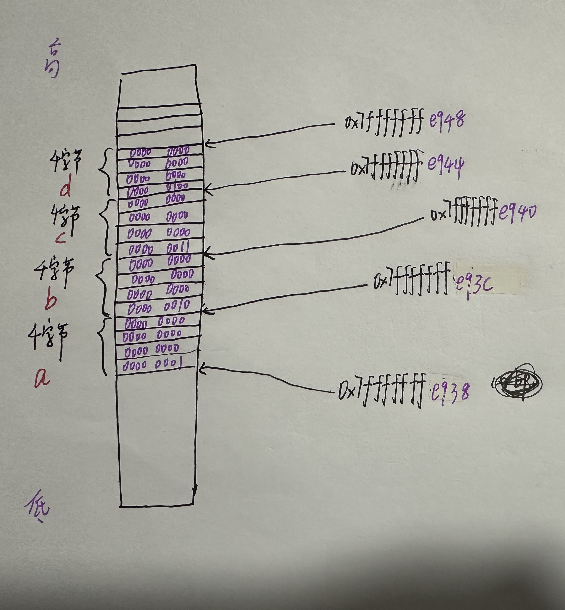

# 汇编-分析函数

## 1. 不带指针和引用的函数

### 1.1 案例一

**Code:**

```c++
#include<iostream>
using namespace std;

int modify_value(int a, int b, int c, int d, int e) {
    a += 10;
    b += 10;
    c += 10;
    d += 10;
    e += 10;
    return 1;
}

int main()
{
    int a = 1;
    int b = 2;
    int c = 3;
    int d = 4;
    int e = 5;
    int result = 0;
    result = modify_value(a, b, c, d, e);
    cout<<result<<endl;
}
```

**汇编代码：**

```assembly
pwndbg> disassemble main
Dump of assembler code for function main():
   0x00005555555551dc <+0>:	endbr64
   0x00005555555551e0 <+4>:	push   rbp
   0x00005555555551e1 <+5>:	mov    rbp,rsp
   0x00005555555551e4 <+8>:	sub    rsp,0x20
   0x00005555555551e8 <+12>:	mov    DWORD PTR [rbp-0x18],0x1
   0x00005555555551ef <+19>:	mov    DWORD PTR [rbp-0x14],0x2
   0x00005555555551f6 <+26>:	mov    DWORD PTR [rbp-0x10],0x3
   0x00005555555551fd <+33>:	mov    DWORD PTR [rbp-0xc],0x4
   0x0000555555555204 <+40>:	mov    DWORD PTR [rbp-0x8],0x5
   0x000055555555520b <+47>:	mov    DWORD PTR [rbp-0x4],0x0
   0x0000555555555212 <+54>:	mov    edi,DWORD PTR [rbp-0x8]
   0x0000555555555215 <+57>:	mov    ecx,DWORD PTR [rbp-0xc]
   0x0000555555555218 <+60>:	mov    edx,DWORD PTR [rbp-0x10]
   0x000055555555521b <+63>:	mov    esi,DWORD PTR [rbp-0x14]
   0x000055555555521e <+66>:	mov    eax,DWORD PTR [rbp-0x18]
   0x0000555555555221 <+69>:	mov    r8d,edi
   0x0000555555555224 <+72>:	mov    edi,eax
   0x0000555555555226 <+74>:	call   0x5555555551a9 <modify_value(int, int, int, int, int)>
   0x000055555555522b <+79>:	mov    DWORD PTR [rbp-0x4],eax
   0x000055555555522e <+82>:	mov    eax,DWORD PTR [rbp-0x4]
   0x0000555555555231 <+85>:	mov    esi,eax
   0x0000555555555233 <+87>:	lea    rdi,[rip+0x2e06]        # 0x555555558040 <std::cout@@GLIBCXX_3.4>
   0x000055555555523a <+94>:	call   0x5555555550b0 <std::ostream::operator<<(int)@plt>
   0x000055555555523f <+99>:	mov    rdx,rax
   0x0000555555555242 <+102>:	mov    rax,QWORD PTR [rip+0x2d87]        # 0x555555557fd0
   0x0000555555555249 <+109>:	mov    rsi,rax
   0x000055555555524c <+112>:	mov    rdi,rdx
   0x000055555555524f <+115>:	call   0x555555555090 <std::ostream::operator<<(std::ostream& (*)(std::ostream&))@plt>
   0x0000555555555254 <+120>:	mov    eax,0x0
   0x0000555555555259 <+125>:	leave
   0x000055555555525a <+126>:	ret
End of assembler dump.
```

```assembly
pwndbg> disassemble modify_value
Dump of assembler code for function modify_value(int, int, int, int, int):
=> 0x00005555555551a9 <+0>:	endbr64
   0x00005555555551ad <+4>:	push   rbp
   0x00005555555551ae <+5>:	mov    rbp,rsp
   0x00005555555551b1 <+8>:	mov    DWORD PTR [rbp-0x4],edi
   0x00005555555551b4 <+11>:	mov    DWORD PTR [rbp-0x8],esi
   0x00005555555551b7 <+14>:	mov    DWORD PTR [rbp-0xc],edx
   0x00005555555551ba <+17>:	mov    DWORD PTR [rbp-0x10],ecx
   0x00005555555551bd <+20>:	mov    DWORD PTR [rbp-0x14],r8d
   0x00005555555551c1 <+24>:	add    DWORD PTR [rbp-0x4],0xa
   0x00005555555551c5 <+28>:	add    DWORD PTR [rbp-0x8],0xa
   0x00005555555551c9 <+32>:	add    DWORD PTR [rbp-0xc],0xa
   0x00005555555551cd <+36>:	add    DWORD PTR [rbp-0x10],0xa
   0x00005555555551d1 <+40>:	add    DWORD PTR [rbp-0x14],0xa
   0x00005555555551d5 <+44>:	mov    eax,0x1
   0x00005555555551da <+49>:	pop    rbp
   0x00005555555551db <+50>:	ret
End of assembler dump.
```

#### 步骤1

```assembly
─────────────────────────────────────────────────────────────[ DISASM / x86-64 / set emulate on ]──────────────────────────────────────────────────────────────
   0x5555555551e8 <main+12>    mov    dword ptr [rbp - 0x18], 1
   0x5555555551ef <main+19>    mov    dword ptr [rbp - 0x14], 2
   0x5555555551f6 <main+26>    mov    dword ptr [rbp - 0x10], 3
   0x5555555551fd <main+33>    mov    dword ptr [rbp - 0xc], 4
   0x555555555204 <main+40>    mov    dword ptr [rbp - 8], 5
 ► 0x55555555520b <main+47>    mov    dword ptr [rbp - 4], 0
   0x555555555212 <main+54>    mov    edi, dword ptr [rbp - 8]
   0x555555555215 <main+57>    mov    ecx, dword ptr [rbp - 0xc]
   0x555555555218 <main+60>    mov    edx, dword ptr [rbp - 0x10]
   0x55555555521b <main+63>    mov    esi, dword ptr [rbp - 0x14]
   0x55555555521e <main+66>    mov    eax, dword ptr [rbp - 0x18]
───────────────────────────────────────────────────────────────────────[ SOURCE (CODE) ]───────────────────────────────────────────────────────────────────────
In file: /home/ubuntu/Dev/Test/base_function.cpp
   15     int a = 1;
   16     int b = 2;
   17     int c = 3;
   18     int d = 4;
   19     int e = 5;
 ► 20     int result = 0;
   21     result = modify_value(a, b, c, d, e);
   22     cout<<result<<endl;
   23 }
───────────────────────────────────────────────────────────────────────────[ STACK ]───────────────────────────────────────────────────────────────────────────
00:0000│ rsp 0x7fffffffe930 ◂— 0x0
01:0008│     0x7fffffffe938 ◂— 0x200000001
02:0010│     0x7fffffffe940 ◂— 0x400000003
03:0018│     0x7fffffffe948 ◂— 0x5
04:0020│ rbp 0x7fffffffe950 ◂— 0x0
05:0028│     0x7fffffffe958 —▸ 0x7ffff7c09083 (__libc_start_main+243) ◂— mov edi, eax
06:0030│     0x7fffffffe960 —▸ 0x7ffff7dd1b80 (main_arena) ◂— 0x0
07:0038│     0x7fffffffe968 —▸ 0x7fffffffea48 —▸ 0x7fffffffecb1 ◂— '/home/ubuntu/Dev/Test/base_function'
```

rbp的地址：0x7fffffffe950

变量a：

+ 地址：rbp - 0x18 = 0x7fffffffe950 - 0x18 = 0x7fffffffe938。
+ 所占空间：dword ptr。表示4个字节的大小

变量b：

+ 地址：rbp - 0x14 = 0x7fffffffe950 - 0x14 = 0x7fffffffe93c
+ 所占空间：dword ptr。表示4个字节的大小

内存图：

 

####  步骤2

分析：

```assembly
   0x555555555212 <main+54>    mov    edi, dword ptr [rbp - 8]
   0x555555555215 <main+57>    mov    ecx, dword ptr [rbp - 0xc]
   0x555555555218 <main+60>    mov    edx, dword ptr [rbp - 0x10]
   0x55555555521b <main+63>    mov    esi, dword ptr [rbp - 0x14]
   0x55555555521e <main+66>    mov    eax, dword ptr [rbp - 0x18]
 ► 0x555555555221 <main+69>    mov    r8d, edi
   0x555555555224 <main+72>    mov    edi, eax
   0x555555555226 <main+74>    call   modify_value(int, int, int, int, int)
```

```assembly
 0x555555555226 <main+74>    call   modify_value(int, int, int, int, int)                <modify_value(int, int, int, int, int)>
        rdi: 0x1
        rsi: 0x2
        rdx: 0x3
        rcx: 0x4
        r8: 0x5
```

得到参数a,b,c,d,e的值是通过寄存器传给调用函数modify_value的。

#### 步骤3

```assembly
  0x5555555551a9 <modify_value(int, int, int, int, int)>       endbr64
   0x5555555551ad <modify_value(int, int, int, int, int)+4>     push   rbp
   0x5555555551ae <modify_value(int, int, int, int, int)+5>     mov    rbp, rsp
 ► 0x5555555551b1 <modify_value(int, int, int, int, int)+8>     mov    dword ptr [rbp - 4], edi
   0x5555555551b4 <modify_value(int, int, int, int, int)+11>    mov    dword ptr [rbp - 8], esi
   0x5555555551b7 <modify_value(int, int, int, int, int)+14>    mov    dword ptr [rbp - 0xc], edx
   0x5555555551ba <modify_value(int, int, int, int, int)+17>    mov    dword ptr [rbp - 0x10], ecx
   0x5555555551bd <modify_value(int, int, int, int, int)+20>    mov    dword ptr [rbp - 0x14], r8d
   0x5555555551c1 <modify_value(int, int, int, int, int)+24>    add    dword ptr [rbp - 4], 0xa
   0x5555555551c5 <modify_value(int, int, int, int, int)+28>    add    dword ptr [rbp - 8], 0xa
   0x5555555551c9 <modify_value(int, int, int, int, int)+32>    add    dword ptr [rbp - 0xc], 0xa
───────────────────────────────────────────────────────────────────────[ SOURCE (CODE) ]───────────────────────────────────────────────────────────────────────
In file: /home/ubuntu/Dev/Test/base_function.cpp
   1 #include<iostream>
   2 using namespace std;
   3
 ► 4 int modify_value(int a, int b, int c, int d, int e) {
   5     a += 10;
   6     b += 10;
   7     c += 10;
   8     d += 10;
   9     e += 10;
───────────────────────────────────────────────────────────────────────────[ STACK ]───────────────────────────────────────────────────────────────────────────
00:0000│ rbp rsp 0x7fffffffe920 —▸ 0x7fffffffe950 ◂— 0x0
01:0008│         0x7fffffffe928 —▸ 0x55555555522b (main+79) ◂— mov dword ptr [rbp - 4], eax
02:0010│         0x7fffffffe930 ◂— 0x0
03:0018│         0x7fffffffe938 ◂— 0x200000001
04:0020│         0x7fffffffe940 ◂— 0x400000003
05:0028│         0x7fffffffe948 ◂— 0x5
06:0030│         0x7fffffffe950 ◂— 0x0
07:0038│         0x7fffffffe958 —▸ 0x7ffff7c09083 (__libc_start_main+243) ◂— mov edi, eax
```

分析：

+ 函数返回地址：0x55555555522b (main+79)。在调用函数modify_value的时候被压入栈了。

#### 步骤4

分析函数modify_value的汇编代码

```assembly
pwndbg> disassemble modify_value
Dump of assembler code for function modify_value(int, int, int, int, int):
=> 0x00005555555551a9 <+0>:	endbr64
   0x00005555555551ad <+4>:	  push   rbp
   0x00005555555551ae <+5>:	  mov    rbp,rsp
   0x00005555555551b1 <+8>:	  mov    DWORD PTR [rbp-0x4],edi
   0x00005555555551b4 <+11>:	mov    DWORD PTR [rbp-0x8],esi
   0x00005555555551b7 <+14>:	mov    DWORD PTR [rbp-0xc],edx
   0x00005555555551ba <+17>:	mov    DWORD PTR [rbp-0x10],ecx
   0x00005555555551bd <+20>:	mov    DWORD PTR [rbp-0x14],r8d
   0x00005555555551c1 <+24>:	add    DWORD PTR [rbp-0x4],0xa
   0x00005555555551c5 <+28>:	add    DWORD PTR [rbp-0x8],0xa
   0x00005555555551c9 <+32>:	add    DWORD PTR [rbp-0xc],0xa
   0x00005555555551cd <+36>:	add    DWORD PTR [rbp-0x10],0xa
   0x00005555555551d1 <+40>:	add    DWORD PTR [rbp-0x14],0xa
   0x00005555555551d5 <+44>:	mov    eax,0x1
   0x00005555555551da <+49>:	pop    rbp
   0x00005555555551db <+50>:	ret
End of assembler dump.
```

这一步将来自主函数的参数值传进来：

```assembly
	 
 0x00005555555551b1 <+8>:	  mov    DWORD PTR [rbp-0x4],edi
 0x00005555555551b4 <+11>:	mov    DWORD PTR [rbp-0x8],esi
 0x00005555555551b7 <+14>:	mov    DWORD PTR [rbp-0xc],edx
 0x00005555555551ba <+17>:	mov    DWORD PTR [rbp-0x10],ecx
 0x00005555555551bd <+20>:	mov    DWORD PTR [rbp-0x14],r8d
```

这一步是执行+操作：

```assembly
 0x00005555555551c1 <+24>:	add    DWORD PTR [rbp-0x4],0xa
 0x00005555555551c5 <+28>:	add    DWORD PTR [rbp-0x8],0xa
 0x00005555555551c9 <+32>:	add    DWORD PTR [rbp-0xc],0xa
 0x00005555555551cd <+36>:	add    DWORD PTR [rbp-0x10],0xa
 0x00005555555551d1 <+40>:	add    DWORD PTR [rbp-0x14],0xa
```

最后是返回值外加恢复堆栈：

```assembly
 0x00005555555551d5 <+44>:	mov    eax,0x1
 0x00005555555551da <+49>:	pop    rbp
 0x00005555555551db <+50>:	ret
```

### 1.2 案例二

**Code:**

```c++
#include<iostream>
using namespace std;

int modify_value(int a, int b, int c, int d, int e, int f, int g) {
    a += 10;
    b += 10;
    c += 10;
    d += 10;
    e += 10;
    f += 10;
    g += 10;
    return 1;
}

int main()
{
    int a = 1;
    int b = 2;
    int c = 3;
    int d = 4;
    int e = 5;
    int f = 6;
    int g = 7;
    int result = 0;
    result = modify_value(a, b, c, d, e, f, g);
    cout<<result<<endl;
}
```

#### 分析main函数

**汇编代码：**

```assembly
pwndbg> disassemble main
Dump of assembler code for function main():
=> 0x00005555555551e8 <+0>:	endbr64
   0x00005555555551ec <+4>:	push   rbp
   0x00005555555551ed <+5>:	mov    rbp,rsp
   0x00005555555551f0 <+8>:	sub    rsp,0x20
   0x00005555555551f4 <+12>:	mov    DWORD PTR [rbp-0x20],0x1
   0x00005555555551fb <+19>:	mov    DWORD PTR [rbp-0x1c],0x2
   0x0000555555555202 <+26>:	mov    DWORD PTR [rbp-0x18],0x3
   0x0000555555555209 <+33>:	mov    DWORD PTR [rbp-0x14],0x4
   0x0000555555555210 <+40>:	mov    DWORD PTR [rbp-0x10],0x5
   0x0000555555555217 <+47>:	mov    DWORD PTR [rbp-0xc],0x6
   0x000055555555521e <+54>:	mov    DWORD PTR [rbp-0x8],0x7
   0x0000555555555225 <+61>:	mov    DWORD PTR [rbp-0x4],0x0
   0x000055555555522c <+68>:	mov    r9d,DWORD PTR [rbp-0xc]
   0x0000555555555230 <+72>:	mov    r8d,DWORD PTR [rbp-0x10]
   0x0000555555555234 <+76>:	mov    ecx,DWORD PTR [rbp-0x14]
   0x0000555555555237 <+79>:	mov    edx,DWORD PTR [rbp-0x18]
   0x000055555555523a <+82>:	mov    esi,DWORD PTR [rbp-0x1c]
   0x000055555555523d <+85>:	mov    eax,DWORD PTR [rbp-0x20]
   0x0000555555555240 <+88>:	mov    edi,DWORD PTR [rbp-0x8]
   0x0000555555555243 <+91>:	push   rdi
   0x0000555555555244 <+92>:	mov    edi,eax
   0x0000555555555246 <+94>:	call   0x5555555551a9 <modify_value(int, int, int, int, int, int, int)>
   0x000055555555524b <+99>:	add    rsp,0x8
   0x000055555555524f <+103>:	mov    DWORD PTR [rbp-0x4],eax
   0x0000555555555252 <+106>:	mov    eax,DWORD PTR [rbp-0x4]
   0x0000555555555255 <+109>:	mov    esi,eax
   0x0000555555555257 <+111>:	lea    rdi,[rip+0x2de2]        # 0x555555558040 <std::cout@@GLIBCXX_3.4>
   0x000055555555525e <+118>:	call   0x5555555550b0 <std::ostream::operator<<(int)@plt>
   0x0000555555555263 <+123>:	mov    rdx,rax
   0x0000555555555266 <+126>:	mov    rax,QWORD PTR [rip+0x2d63]        # 0x555555557fd0
   0x000055555555526d <+133>:	mov    rsi,rax
   0x0000555555555270 <+136>:	mov    rdi,rdx
   0x0000555555555273 <+139>:	call   0x555555555090 <std::ostream::operator<<(std::ostream& (*)(std::ostream&))@plt>
   0x0000555555555278 <+144>:	mov    eax,0x0
   0x000055555555527d <+149>:	leave
   0x000055555555527e <+150>:	ret
End of assembler dump.
```

分析：

变量的初始位置：

```assembly
 0x00005555555551f4 <+12>:	mov    DWORD PTR [rbp-0x20],0x1  #a
 0x00005555555551fb <+19>:	mov    DWORD PTR [rbp-0x1c],0x2  #b
 0x0000555555555202 <+26>:	mov    DWORD PTR [rbp-0x18],0x3  #c
 0x0000555555555209 <+33>:	mov    DWORD PTR [rbp-0x14],0x4  #d
 0x0000555555555210 <+40>:	mov    DWORD PTR [rbp-0x10],0x5  #e
 0x0000555555555217 <+47>:	mov    DWORD PTR [rbp-0xc],0x6  #f
 0x000055555555521e <+54>:	mov    DWORD PTR [rbp-0x8],0x7  #g
```

然后变化：

```assembly
 0x000055555555522c <+68>:	mov    r9d,DWORD PTR [rbp-0xc]
 0x0000555555555230 <+72>:	mov    r8d,DWORD PTR [rbp-0x10]
 0x0000555555555234 <+76>:	mov    ecx,DWORD PTR [rbp-0x14]
 0x0000555555555237 <+79>:	mov    edx,DWORD PTR [rbp-0x18]
 0x000055555555523a <+82>:	mov    esi,DWORD PTR [rbp-0x1c]
 0x000055555555523d <+85>:	mov    eax,DWORD PTR [rbp-0x20]
 0x0000555555555240 <+88>:	mov    edi,DWORD PTR [rbp-0x8]
 0x0000555555555243 <+91>:	push   rdi
 0x0000555555555244 <+92>:	mov    edi,eax
```

```assembly
0x555555555246 <main+94>     call   modify_value(int, int, int, int, int, int, int)                <modify_value(int, int, int, int, int, int, int)>
        rdi: 0x1  #a
        rsi: 0x2  #b
        rdx: 0x3  #c
        rcx: 0x4  #d
        r8: 0x5  #e
        r9: 0x6  #f
        arg[6]: 0x7  #g
```

一共有6个寄存器用来存放函数的参数，多了就用内存来代替，比如g就存放在`DWORD PTR [rbp-0x8]`中，而不是寄存器中。

#### 分析modify_value

```assembly
pwndbg> disassemble modify_value(int, int, int, int, int, int, int)
Dump of assembler code for function modify_value(int, int, int, int, int, int, int):
   0x00005555555551a9 <+0>:	endbr64
   0x00005555555551ad <+4>:	push   rbp
   0x00005555555551ae <+5>:	mov    rbp,rsp
   0x00005555555551b1 <+8>:	mov    DWORD PTR [rbp-0x4],edi
   0x00005555555551b4 <+11>:	mov    DWORD PTR [rbp-0x8],esi
   0x00005555555551b7 <+14>:	mov    DWORD PTR [rbp-0xc],edx
   0x00005555555551ba <+17>:	mov    DWORD PTR [rbp-0x10],ecx
   0x00005555555551bd <+20>:	mov    DWORD PTR [rbp-0x14],r8d
   0x00005555555551c1 <+24>:	mov    DWORD PTR [rbp-0x18],r9d
   0x00005555555551c5 <+28>:	add    DWORD PTR [rbp-0x4],0xa
   0x00005555555551c9 <+32>:	add    DWORD PTR [rbp-0x8],0xa
   0x00005555555551cd <+36>:	add    DWORD PTR [rbp-0xc],0xa
   0x00005555555551d1 <+40>:	add    DWORD PTR [rbp-0x10],0xa
   0x00005555555551d5 <+44>:	add    DWORD PTR [rbp-0x14],0xa
   0x00005555555551d9 <+48>:	add    DWORD PTR [rbp-0x18],0xa
   0x00005555555551dd <+52>:	add    DWORD PTR [rbp+0x10],0xa  #g
   0x00005555555551e1 <+56>:	mov    eax,0x1
   0x00005555555551e6 <+61>:	pop    rbp
   0x00005555555551e7 <+62>:	ret
End of assembler dump.
pwndbg>
```

## 2. 带指针的函数

