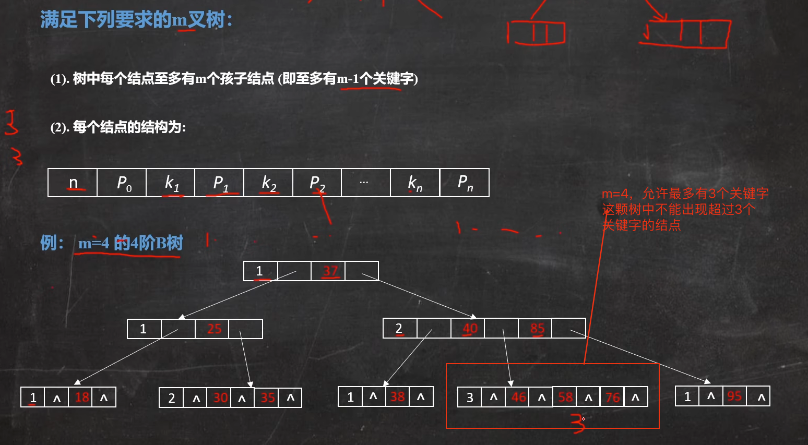
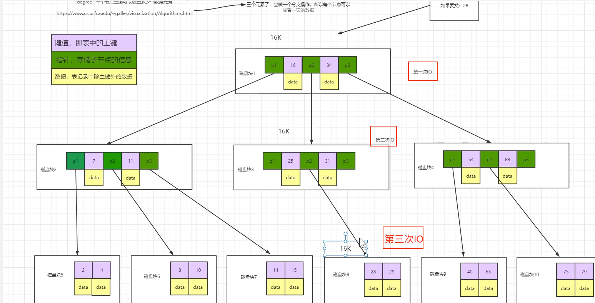
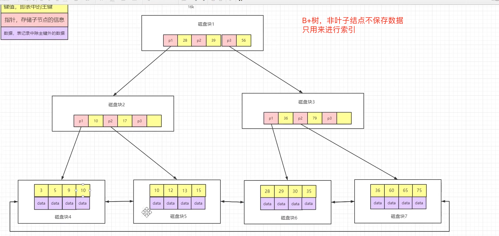
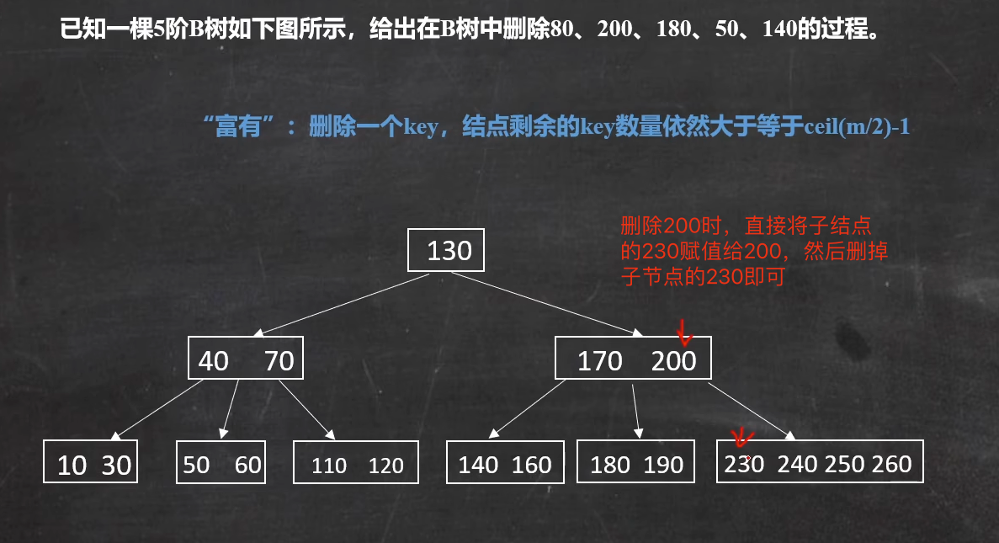
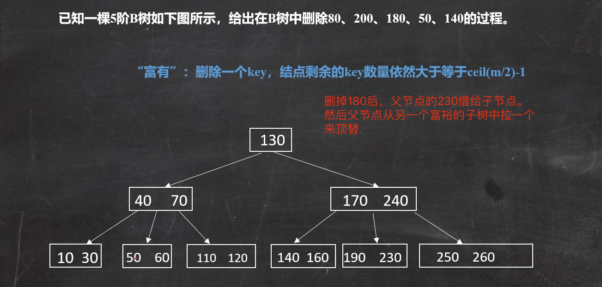

# B树

## 1. 问题

## 2. 外部资料

算法可视化网址：

https://www.cs.usfca.edu/~galles/visualization/Algorithms.html

B站视频：

https://www.bilibili.com/video/BV13o4y1t7Ti/?spm_id_from=333.337.search-card.all.click&vd_source=c6838f09fbfc9766e04f0c65ca196c42

https://www.bilibili.com/video/BV1mY4y1W7pS/?spm_id_from=333.337.search-card.all.click&vd_source=c6838f09fbfc9766e04f0c65ca196c42

## 3. 基础知识

### 3.1 简单介绍

B树（B-Tree）是一种自平衡的树数据结构，尤其适用于外存储设备（如磁盘）上的大量数据存储和检索。其基本知识点包括：

1. **定义**：在B树中，每个节点可以有多个子节点，且节点可以存储多个键值及对应的指针。它的特点是所有叶子节点在同一层，且每个节点都维持着某个固定的“阶”（degree），即最多有多少个孩子。

2. **特性**：
   - 每个节点最多包含m个孩子，最少是⌈m/2⌉（其中m为树的阶）。
   - 除了根节点和叶子节点外，其它每个节点至少有⌈m/2⌉个孩子。
   - 如果一个节点有n个孩子，则它有n-1个关键字。  
   - 所有的叶子节点都在同一层，且不包含任何信息（也可以存储数据或者指向数据的指针）。
   - 关键字是有序的，且分割相邻孩子的边界。

3. **查找、插入、删除操作**：在B树上进行查找、插入和删除操作时，通过关键字在节点内部进行比较和移动，能够保持相对较少的I/O次数，大大提高了在外部存储器上进行数据访问的效率。

4. **应用**：数据库系统和文件系统广泛使用B树及其变种（如B+树、B*树等）来管理索引，使得即使在海量数据的情况下也能快速定位到需要的数据。

5. **优势**：B树的主要优势在于减少磁盘I/O操作，因为一次磁盘I/O可能读取多个节点的关键字和子节点指针，使得搜索过程能以较为连续的方式进行，有效利用了磁盘预读功能。

### 3.2 为什么引入B树

从磁盘查找数据效率低，一般是什么原因？

+ 影响IO效率的因素：

  + 读写数据越大速度越慢

  + 读写次数越多速度越慢

### 3.3 B树的样子

 

## 3. 查找和删除

### 3.1 查找

B树：

 

B+树：

 

### 3.2 删除

 

 

## 4. 优点和缺点

B树（B-tree）是一种自平衡的树数据结构，能够保持数据有序，并允许以对数时间复杂度进行查找、插入和删除等操作。它在数据库和文件系统中广泛应用。下面是B树的一些优点和缺点：

**优点：**

1. **平衡性**：B树是一种平衡树，所有叶子节点都位于同一层，这保证了查找、插入和删除等操作的时间复杂度较低，且性能稳定。
2. **磁盘友好**：B树的设计使得它非常适合磁盘或其他直接存取辅助设备。通过最大化磁盘块（或节点）的利用率，B树减少了磁盘I/O操作次数，提高了性能。
3. **可扩展性**：B树能够处理大量的数据，并且可以动态地增长和缩减，而不需要重新组织或重新平衡树结构。
4. **范围查询效率**：虽然B树本身不是为范围查询优化的数据结构（这一点不如B+树），但其有序性使得范围查询仍然比无序数据结构高效得多。

**缺点：**

1. **空间利用率**：与一些其他数据结构（如哈希表）相比，B树在空间利用率方面可能不是最优的。因为B树需要存储额外的指针和节点信息来维护树的平衡。
2. **实现复杂度**：B树的实现相对复杂，需要处理节点的分裂和合并等情况。这增加了代码复杂性和出错的可能性。
3. **不适用于所有场景**：虽然B树在许多场景中都非常有用，但它并不适用于所有情况。例如，对于需要频繁进行点查询（即查找单个键）且不需要范围查询的应用，哈希表可能是一个更好的选择。

需要注意的是，这些优缺点是相对于其他数据结构而言的，并且在不同应用场景中的权重可能会有所不同。在选择数据结构时，需要根据具体的应用需求进行权衡。

 

