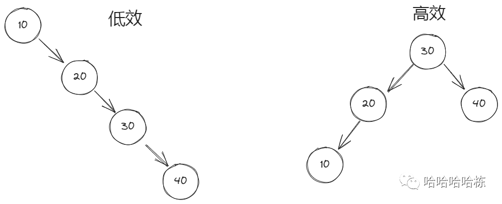
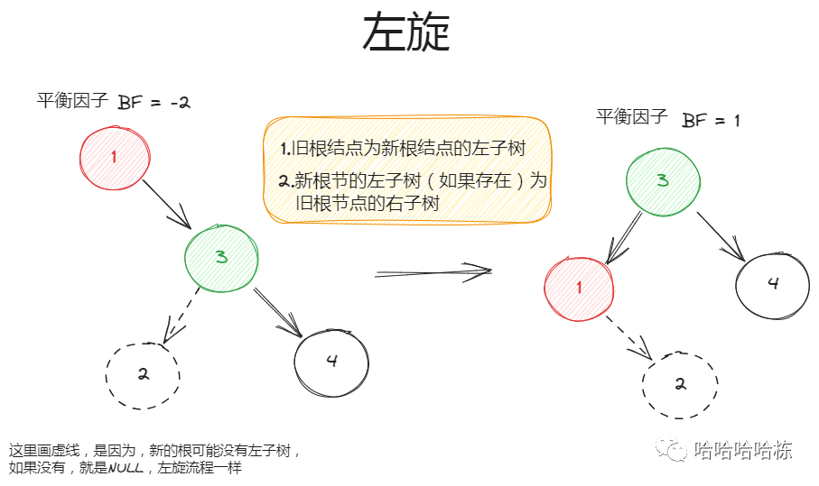
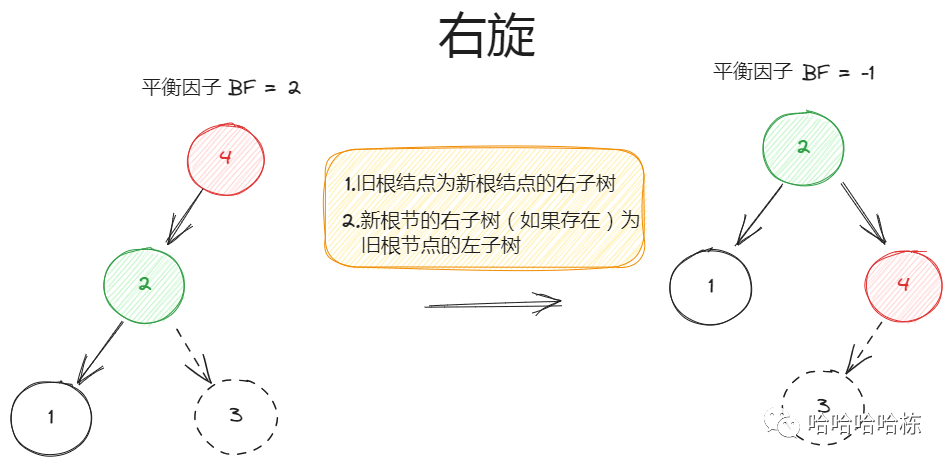
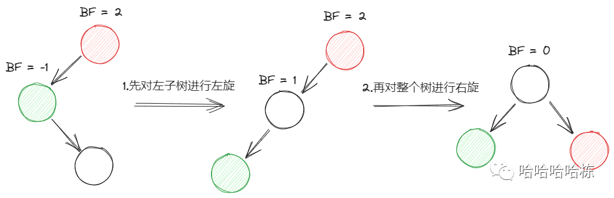
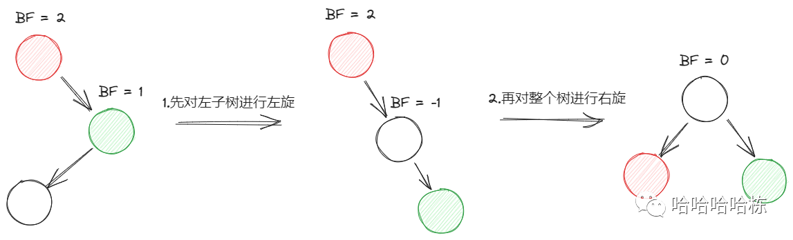

# 二叉平衡树

## 1. 问题

## 2. 基本概念

### 2.1 外部资料

https://zhuanlan.zhihu.com/p/77109320

https://www.bilibili.com/video/BV1S94y1V7wL/?spm_id_from=333.999.0.0&vd_source=c6838f09fbfc9766e04f0c65ca196c42

### 2.2 什么是二叉平衡树

平衡二叉搜索树（Self-balancing binary search tree）又被称为AVL树（有别于AVL算法），且具有以下性质：它是一棵空树或它的左右两个子树的高度差的绝对值不超过1，并且左右两个子树都是一棵平衡二叉树，同时，平衡二叉树必定是二叉排序树。

高度差可以用平衡因子bf来定义，我们用左子树的高度减去右子树的高度来表示bf，即-1<|bf|<1。

引入平衡二叉树是由于二叉排序树，在某些情况会导致树的高度一直的增加，比如一组有序的数据，在查找或创建时递归层级会很深，导致方法栈容易溢出。

### 2.3 AVL有什么用？

我们用二叉搜索树，是因为，我们希望我们查找节点的效率是O(logn) 但是如果我们是按顺序插入的，那查找的效率就会变成O(n)那就和链表一样了，使用二叉搜索树的优势就没有了。

所以，为了保证我们使用树结构做查找的时候，都能尽可能是O(logn)所以就要使用平衡二叉树。

### 2.4 什么情况下会失衡？

 

这里很明显能看到，左边的这个树，左子树为空，右子树高度为3。左子树高度-右子树高度 = -3 右边这棵树，左子树高度为2，右子树高度为1。左子树高度-右子树高度 = 1

其实我们还可以发现，对于右边这棵树的每一个结点，其左右子树高度之差的绝对值没有大于1的。

所以，如果当一个树或者子树的左右子树高度之差绝对值大于等于2了，我们认为它失衡了，这棵树改一改还能更高效。

同时，对于每个结点，以这个结点为根的子树，其左右子树高度之差叫做这个子树或者这个结点的`平衡因子`。我们希望，所有结点的平衡因子都小于2。

## 3. 两种旋转方式

### 3.1 左旋

**旋转流程**

1. 旧根节点为新根节点的左子树
2. 新根节点的左子树（如果存在）为旧根节点的右子树

 

```c++
//左旋：
//  1.当前结点的右子树会作为新树的根结点
//  2.当前结点会作为新树的根结点的左子树
//  3.如果，新的树根，原来有左子树，原来的左子树，就作为旧根结点的右子树
TreeNode* BinaryTree::left_rotate(TreeNode* root) {
    TreeNode* new_root = root->right_;  //对应步骤1
    TreeNode* root_rl = root->right_->left_;  //保存当前结点的右子树的左子树结点
    new_root->left_ = root;  //对应步骤2
    root->right_ = root_rl;  //对应步骤3
    return new_root;  //将新根结点返回
}
```

### 3.2 右旋

**旋转流程**

1. 旧根结点为新根结点的右子树
2. 新的根结点的原来的右子树（如果存在）则作为旋转后旧的根结点的左子树

 

```c++
//右旋：
//  1.当前结点的左子树会作为新树的根结点
//  2.当前结点会作为新树的根结点的右子树
//  3.如果，新的树根，原来有右子树，原来的右子树，就作为就根结点的左子树
TreeNode* BinaryTree::right_rotate(TreeNode* root) {
    TreeNode* new_root = root->left_;  //对应步骤1
    TreeNode* root_lr = root->left_->right_;  //保存当前结点的左子树的右子树结点
    new_root->right_ = root;  //对应步骤2
    root->left_ = root_lr;  //对应步骤3
    return new_root;  //将新根结点返回
}
```

## 4. 四种需要旋转的情况

**什么时候就要旋转了？**

想一个问题，会等到不平衡因子到3了再旋转吗？不可能，当不平衡情况刚出现，就要立马进行旋转，也就是说，当不平衡因子是2的时候就要旋转了。

**旋转哪棵树?**

有这么一种情况，插入了一个结点，导致一个子树不平衡了， 导致整个二叉树也不平衡了，该转子树还是整个树？肯定是先转发生不平衡的最小的那个子树，那个子树转好了，说不定整个树就不用转了。当然还有一种情况，就是子树不平衡，但是整个树是平衡的，这样不用说，只用转子树就行了。所以，综上，我们要转的就是发生不平衡的最小的那个二叉树。当最小的不平衡二叉树转平衡了，如果还不平衡，再找下一个最小不平衡的二叉树进行修改。

上面已经介绍了两种基础的旋转情况，后面的4四种导致二叉平衡树失衡的都可以通过上面两种基础的旋转来解决。

**什么情况可能导致失衡呢？**

-  插入
- 删除

**插入可能导致哪几种情况的失衡呢？**

- 在左孩子的左子树多了结点后导致失衡 LL型
- 在左孩子的右子树多了结点后导致失衡 LR型
- 在右孩子的左子树多了结点后导致失衡 RL型
- 在右孩子的右子树多了结点后导致失衡 RR型

### 4.1 LL型失衡

描述：最小失衡子树的左孩子的左子树多了个结点导致失衡了。解决：

- 使用右旋就能解决，右旋看前面。

### 4.2 LR型失衡

描述：最小失衡子树的左孩子的右子树多了个结点导致失衡了。解决：

- 左子树先进行左旋。这时候就可以看成了LL型
- 然后整个树进行右旋

 

### 4.3 RR型失衡

描述：最小失衡子树的右孩子的右子树多了个节点导致失衡了 解决：

- 使用左旋就能解决了，左旋看前面。

### 4.4 RL型失衡

描述：最小失衡子树的右孩子的左子树多了个节点导致失衡了 解决：

- 对右子树先进行右旋，这样就会变成RR型失衡
- 对整个树左旋

 

## 5. 代码

[avl_tree.cpp](https://github.com/niu0217/Documents/blob/main/C%2B%2B/datastructure/code/avl_tree.cpp)