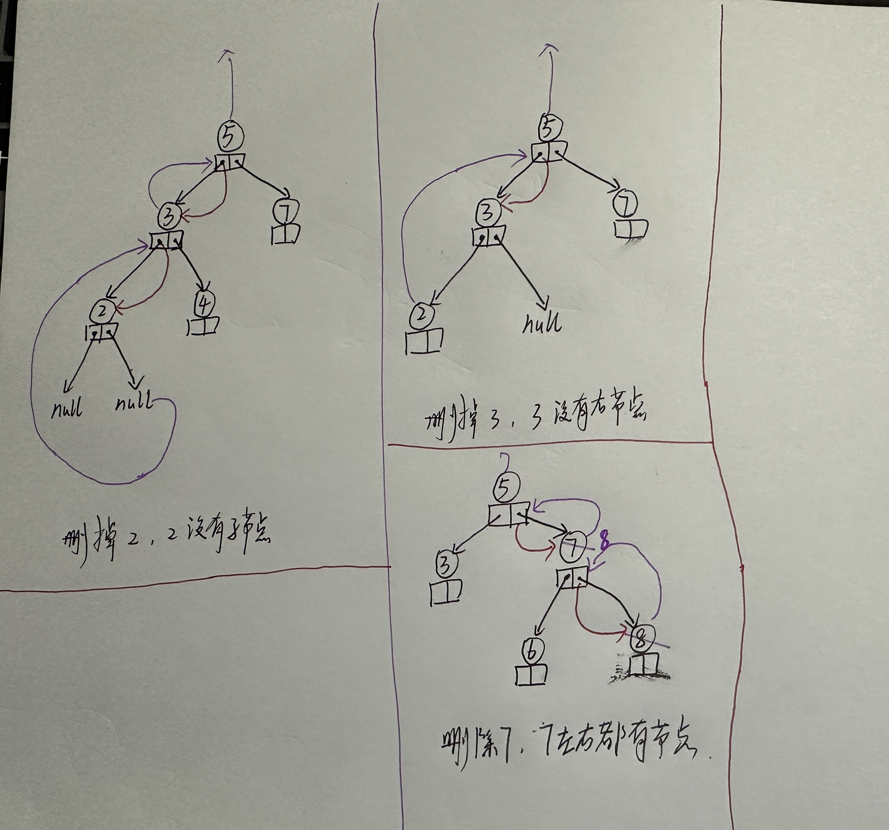

# 二叉搜索树

## 1. 问题

## 2. 基本概念

二叉搜索树（Binary Search Tree，简称BST）是C++和其他编程语言中常用的一种数据结构。它是一种特殊的二叉树，具有以下性质：

1. **有序性**：对于树中的每个节点，其左子树中的所有节点的值都小于该节点的值，而其右子树中的所有节点的值都大于该节点的值。
2. **无重复**：在标准的二叉搜索树中，每个节点的值都是唯一的，没有重复的值。
3. **结构**：二叉搜索树可以是空的，或者由一个根节点和两棵互不相交的、分别称为左子树和右子树的二叉搜索树组成。

由于这些性质，二叉搜索树在查找、插入和删除操作中表现出良好的性能（在平衡的情况下）。

### 2.1 查找操作：

在BST中查找一个值，从根节点开始：

- 如果根节点为空，返回未找到。
- 如果根节点的值与要查找的值相等，返回根节点。
- 如果要查找的值小于根节点的值，则在左子树中递归查找。
- 如果要查找的值大于根节点的值，则在右子树中递归查找。

### 2.2 插入操作：

向BST中插入一个新值，也是从根节点开始：

- 如果树为空，创建一个新节点作为根节点。
- 如果要插入的值小于当前节点的值，将其插入到左子树中；如果左子树为空，则创建一个新节点作为左子节点。
- 如果要插入的值大于当前节点的值，将其插入到右子树中；如果右子树为空，则创建一个新节点作为右子节点。
- 递归地重复上述步骤，直到找到合适的插入位置。

### 2.3 删除操作：

从BST中删除一个值稍微复杂一些，因为需要考虑多种情况来保持树的性质不变：

- 如果要删除的节点是叶子节点（没有子节点），直接删除该节点。
- 如果要删除的节点只有一个子节点，删除该节点并将其父节点的相应指针指向其子节点。
- 如果要删除的节点有两个子节点，找到其后继节点（右子树中的最小值）或前驱节点（左子树中的最大值），用该节点的值替换要删除的节点的值，然后删除后继或前驱节点。

### 2.4 平衡问题：

标准的二叉搜索树在最坏的情况下（输入的数据已经有序或接近有序）可能退化成链表结构，此时搜索的时间复杂度会增加到O(n)。为了解决这个问题，可以使用平衡二叉搜索树（如AVL树或红黑树），它们通过特定的旋转规则来保持树的平衡，从而确保搜索、插入和删除操作的时间复杂度始终为O(log n)。

二叉搜索树在C++中通常通过定义一个结构体或类来实现，该类包含节点的值和指向左右子节点的指针。通过递归地应用上述算法，可以轻松地实现BST的所有基本操作。

## 3. 性能分析

二叉搜索树（Binary Search Tree, BST）在C++中是一种非常有用的数据结构，它结合了链表和二分搜索的优势。然而，像所有数据结构一样，它也有其优点和缺点。

### 3.1 优点：

1. **搜索效率高**：在平衡的情况下（即树的左右子树高度大致相等），BST的搜索时间复杂度为O(log n)，其中n是树中节点的数量。这比在数组中搜索的O(n)要好得多。
2. **插入和删除效率高**：在BST中插入或删除一个节点通常也是O(log n)的时间复杂度，因为需要先找到合适的位置，再进行常数时间的插入或删除操作。
3. **动态数据结构**：与数组不同，BST是一种动态数据结构，可以在运行时增加或减少元素，而不需要预先分配固定大小的内存空间。
4. **中序遍历有序**：BST的一个重要性质是其中序遍历（左-根-右）结果是有序的，这使得它非常适合需要有序数据的场景。

### 3.2 缺点：

1. **可能不平衡**：如果输入数据是有序的或接近有序的，BST可能会退化成链表结构，此时搜索、插入和删除的时间复杂度将增加到O(n)。这可以通过使用平衡二叉搜索树（如AVL树或红黑树）来解决。
2. **需要额外空间**：每个节点都需要指针来指向其左右子节点，这增加了空间消耗。对于大量数据，这可能会成为一个问题。
3. **实现复杂**：相比数组和链表，BST的实现要复杂得多，尤其是在处理删除操作时，需要考虑多种不同的情况。

### 3.3 增删查改的效率：

- **查找（Search）**：在平衡的情况下，查找的时间复杂度是O(log n)。在最坏的情况下（树退化成链表），时间复杂度是O(n)。
- **插入（Insert）**：插入一个新节点通常需要找到其在树中的位置，这需要O(log n)的时间（在平衡的情况下）。一旦找到位置，插入操作本身是O(1)的。因此，总的时间复杂度是O(log n)。在最坏的情况下，插入的时间复杂度是O(n)。
- **删除（Delete）**：删除一个节点可能需要找到该节点（O(log n)），然后处理三种不同的情况：没有子节点、有一个子节点或有两个子节点。处理这些情况可能需要额外的时间，但在大多数情况下，删除操作的总时间复杂度仍然是O(log n)。在最坏的情况下（树不平衡），时间复杂度是O(n)。
- **修改（Update）**：在BST中，“修改”通常意味着先找到要修改的节点，然后更新其值。因此，修改的时间复杂度与查找相同，即在最好的情况下是O(log n)，在最坏的情况下是O(n)。

为了提高BST的性能，特别是在最坏的情况下，可以使用自平衡二叉搜索树（如AVL树或红黑树），它们通过特定的旋转和重新平衡操作来保持树的平衡状态。

## 4. 代码

[bst_tree.cpp](https://github.com/niu0217/Documents/blob/main/C%2B%2B/datastructure/code/bst_tree.cpp)

## 5. 分析代码

### 5.1 删除一个节点

```c++
TreeNode* BinaryTree::deleteOneNodeHelper(TreeNode* rootOfTree, int toDeleteNodeValue) {
    if(rootOfTree == nullptr) {
        return rootOfTree;
    }
    if(toDeleteNodeValue < rootOfTree->value) {
        rootOfTree->left = deleteOneNodeHelper(rootOfTree->left, toDeleteNodeValue);
    }
    else if(toDeleteNodeValue > rootOfTree->value) {
        rootOfTree->right = deleteOneNodeHelper(rootOfTree->right, toDeleteNodeValue);
    }
    else {
        if(rootOfTree->left == nullptr) {
            //只有一个右结点或者没有子结点
            TreeNode* afterDeleteSubtreeRoot = rootOfTree->right;
            delete rootOfTree;
            rootOfTree = nullptr;
            return afterDeleteSubtreeRoot;
        }
        else if(rootOfTree->right == nullptr) {
            //只有一个左结点或者没有子结点
            TreeNode* afterDeleteSubtreeRoot = rootOfTree->left;
            delete rootOfTree;
            rootOfTree = nullptr;
            return afterDeleteSubtreeRoot;
        }
        else {
            //有两个子结点，获取右子树中的最小值结点来替换
            //当前结点，并删除哪个最小值结点
            TreeNode* minSubtreeNode = getMinvalueNode(rootOfTree->right);
            rootOfTree->value = minSubtreeNode->value;
            rootOfTree->right = deleteOneNodeHelper(rootOfTree->right, minSubtreeNode->value);
        }
    }
    return rootOfTree;
}
```

 


