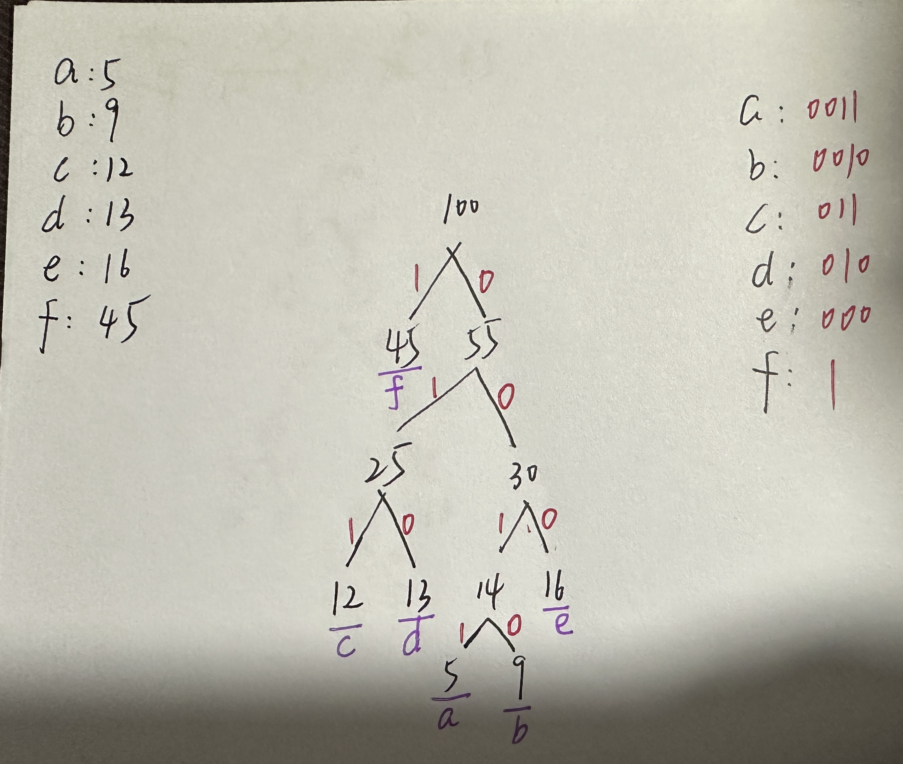

# 哈夫曼树

## 1. 问题

## 2. 外部资料

b站视频：

https://www.bilibili.com/video/BV1kD4y1P76D/?spm_id_from=333.337.search-card.all.click&vd_source=c6838f09fbfc9766e04f0c65ca196c42

## 3. 基础知识

### 3.1 什么是哈夫曼树

哈夫曼树（Huffman Tree）又称最优二叉树，是一种带权路径长度最短的二叉树，也是一种应用广泛的二叉树。其特点是**权值较大的结点离根较近，而权值较小的结点离根较远。**树的带权路径长度记为WPL，即将所有叶子结点的带权路径长度求和，权值越大的结点越靠近根，树的带权路径长度就越小。

哈夫曼树的构造过程如下：

1. 根据给定的n个权值{w1,w2,…,wn}构成n棵二叉树的集合F={T1,T2,…,Tn}，其中每棵二叉树Ti中只有一个带权为wi的根结点，其左右子树均为空。
2. 在F中选取两棵根结点的权值最小的树作为左右子树构造一棵新的二叉树，且置新的二叉树的根结点的权值为其左右子树上根结点的权值之和。
3. 在F中删除这两棵树，同时将新得到的二叉树加入F中。
4. 重复上述操作，直到F中只剩下一棵二叉树为止。这棵树便是哈夫曼树。

哈夫曼树的应用非常广泛，主要用于数据压缩，通信中的编码、解码等。例如，在数据压缩中，我们可以将出现频率高的字符用较短的编码表示，而出现频率低的字符用较长的编码表示，从而达到压缩数据的目的。这种方法称为哈夫曼编码，是一种无损压缩方法。

此外，哈夫曼树还可以用于其他问题，如最优前缀码问题、判定问题等。在这些问题中，哈夫曼树都发挥了重要作用。

### 3.2 什么是哈夫曼编码

哈夫曼编码（Huffman Coding）是一种基于字符出现概率的可变长度前缀编码方法，由美国计算机科学家戴维·A·哈夫曼在1952年提出。该编码算法主要应用于数据压缩领域，通过构建最优二叉树（也称为哈夫曼树或最小带权路径长度树）来实现对原始数据中不同符号的高效编码。

**基本思想**：
- 对于一个给定的数据集，每个字符或符号都有其对应的出现频率。
- 哈夫曼编码的原则是将高频出现的符号用较短的编码表示，而低频出现的符号用较长的编码表示，从而使得整个编码系统能以最少的平均比特数来表示原数据集。
- 实现过程：首先根据频率构建哈夫曼树，即每次选取频率最低的两个节点合并生成新的父节点，并以其子节点的频率之和作为新节点的频率，重复此过程直至所有节点合并成一棵树。
- 从这棵树中自底向上构造编码，左分支代表0，右分支代表1，到达每个叶子节点时形成的编码路径即为该叶子节点对应符号的哈夫曼编码。

**特点**：
- **哈夫曼编码是无前缀编码，即任一编码都不是其他编码的前缀**，这确保了编码的唯一解码性。
- 因为它是可变长度编码，所以它比固定长度编码（如ASCII编码）在处理具有不平衡频率分布的数据时更加高效，可以显著减少存储空间。

**应用**：

- 数据压缩：文本文件、音频文件、视频文件等都可以使用哈夫曼编码进行压缩。
- 文件格式：许多文件格式中都采用类似哈夫曼编码的技术，如JPEG图像格式中的DCT系数编码、DEFLATE算法（用于ZIP和PNG文件格式）等。

### 3.3 优点和缺点

哈夫曼树（Huffman Tree）是一种特殊的二叉树，它根据字符出现的频率构建，用于数据压缩等领域。哈夫曼树具有一些显著的优点和缺点。

优点：

1. 编码效率高：哈夫曼树根据字符出现的频率进行编码，频率高的字符使用较短的编码，频率低的字符使用较长的编码，从而实现了高效的数据压缩。
2. 自适应性：哈夫曼编码可以自适应地调整编码长度，以适应不同字符集和概率分布的情况。这使得哈夫曼编码在多种场景下都能获得较好的压缩效果。
3. 易于实现：哈夫曼树的构建过程相对简单，易于理解和实现。同时，哈夫曼编码的解码过程也比较容易，只需按照编码时的逆过程进行即可。

缺点：

1. 编码长度可变：哈夫曼编码的长度是可变的，这使得在解码时需要额外的信息来确定每个字符的编码长度。这可能会增加解码的复杂性和时间开销。
2. 对小概率事件不友好：当字符集中包含大量出现概率极低的字符时，哈夫曼编码可能会导致这些字符的编码长度过长，从而降低压缩效率。
3. 存储空间需求：虽然哈夫曼编码可以有效地压缩数据，但在某些情况下，存储哈夫曼树本身可能需要额外的空间。这可能会抵消部分压缩效果，特别是在处理较小规模的数据时。
4. 计算开销：构建哈夫曼树和进行编码解码操作都需要一定的计算资源。在处理大规模数据或实时性要求较高的场景下，这可能会成为性能瓶颈。

需要注意的是，哈夫曼树的优缺点会因应用场景和需求的不同而有所变化。在实际应用中，需要根据具体情况权衡这些因素来选择合适的数据压缩方法。

## 4. 代码

[huffmantree.cpp](https://github.com/niu0217/Documents/blob/main/C%2B%2B/datastructure/code/huffmantree.cpp)

```c++
#include<iostream>
#include<vector>
#include<queue>
#include<map>
#include<string>
#include<sstream>

struct HuffmanTreeNode {
    char data;
    int weight;
    HuffmanTreeNode* left;
    HuffmanTreeNode* right;
    HuffmanTreeNode(char initialData, int initialWeight,
            HuffmanTreeNode* initialLeft = nullptr,
            HuffmanTreeNode* initialRight = nullptr)
        : data{ initialData }, weight{ initialWeight},
          left{ initialLeft }, right{ initialRight } { }
};

struct Compare {
    bool operator()(const HuffmanTreeNode* leftTreeNode,
                    const HuffmanTreeNode* rightTreeNode) const {
        return leftTreeNode->weight > rightTreeNode->weight;
    }
};

class HuffmanTree {
public:
    HuffmanTree() : root{ nullptr } { }
    ~HuffmanTree() {
        deleteAllNodes();
    }

    void buildHuffmanTree(const std::map<char, int>& treeDatas);
    void generateHuffmanCodes(std::string code,
      std::map<char, std::string>& huffmanCodes) const;
    void generateHuffmanCodesHelper(HuffmanTreeNode* rootOfTree,
      std::string code, std::map<char, std::string>& huffmanCodes) const;

    void deleteAllNodes();
    void deleteAllNodesHelper(HuffmanTreeNode* rootOfTree);
private:
    HuffmanTreeNode* root;
};

void HuffmanTree::buildHuffmanTree(const std::map<char, int>& treeDatas) {
    std::priority_queue<HuffmanTreeNode*, std::vector<HuffmanTreeNode*>, Compare> minheapPQ;
    for(const auto& treeData : treeDatas) {
        minheapPQ.push(new HuffmanTreeNode(treeData.first, treeData.second));
    }
    while(minheapPQ.size() > 1) {
        HuffmanTreeNode* leftTreeNode = minheapPQ.top();
        minheapPQ.pop();
        HuffmanTreeNode* rightTreeNode = minheapPQ.top();
        minheapPQ.pop();
        int sumOfWeight = leftTreeNode->weight + rightTreeNode->weight;
        //0代表这是一个非叶子结点
        minheapPQ.push(new HuffmanTreeNode(0, sumOfWeight, leftTreeNode, rightTreeNode));
    }
    root = minheapPQ.top();
    minheapPQ.pop();
}

void HuffmanTree::generateHuffmanCodes(std::string code,
  std::map<char, std::string>& huffmanCodes) const {
    generateHuffmanCodesHelper(root, code, huffmanCodes);
}

void HuffmanTree::generateHuffmanCodesHelper(HuffmanTreeNode* rootOfTree,
  std::string code, std::map<char, std::string>& huffmanCodes) const {
    if(rootOfTree == nullptr) {
        return;
    }
    if(rootOfTree->data != 0) {
        //叶子结点
        huffmanCodes[rootOfTree->data] = code;
    }
    else {
        //非叶子结点
        generateHuffmanCodesHelper(rootOfTree->left, code + "1", huffmanCodes);
        generateHuffmanCodesHelper(rootOfTree->right, code + "0", huffmanCodes);
    }
}

void HuffmanTree::deleteAllNodes() {
    deleteAllNodesHelper(root);
}
void HuffmanTree::deleteAllNodesHelper(HuffmanTreeNode* rootOfTree) {
    if(rootOfTree == nullptr) {
        return;
    }
    deleteAllNodesHelper(rootOfTree->left);
    deleteAllNodesHelper(rootOfTree->right);
    std::cout<<"delete "<<rootOfTree->data<<"\n";
    delete rootOfTree;
    rootOfTree = nullptr;
}

int main()
{
    std::map<char, int> treeDatas = {
        {'a', 5}, {'b', 9}, {'c', 12}, {'d', 13}, {'e', 16}, {'f', 45}
    };
    HuffmanTree* huffmanTree = new HuffmanTree();

    huffmanTree->buildHuffmanTree(treeDatas);

    std::map<char, std::string> huffmanCodes;
    huffmanTree->generateHuffmanCodes("", huffmanCodes);
    for(const auto& data : huffmanCodes) {
        std::cout<<data.first<<": "<<data.second<<"\n";
    }

    delete huffmanTree;
    huffmanTree = nullptr;
}
```

 
