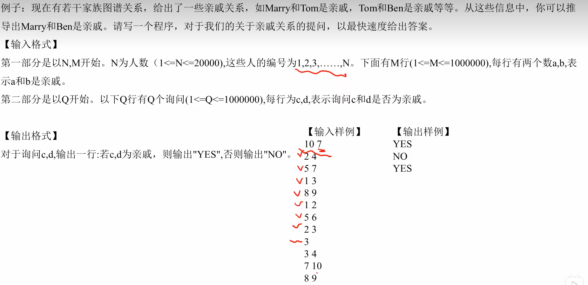

# 并查集

## 1. 问题

## 2. 外部资料

b站视频：

https://www.bilibili.com/video/BV1Wv4y1f7n1/?spm_id_from=333.337.search-card.all.click&vd_source=c6838f09fbfc9766e04f0c65ca196c42

https://www.bilibili.com/video/BV1jv411a7LK/?spm_id_from=333.337.search-card.all.click&vd_source=c6838f09fbfc9766e04f0c65ca196c42

## 3. 基础知识

### 3.1 什么是并查集

并查集是一种树型的数据结构，**用于处理一些不相交集合（Disjoint Sets）的合并及查询问题**。其主要涉及两个基本操作：合并两个不相交集合以及判断两个元素是否属于同一个集合。

基本概念：

1. 集合：并查集中的元素被分成若干个不相交的集合，每个集合通过代表元素来标识。
2. 代表元素：每个集合都有一个代表元素，通常选择集合中的某个元素作为代表，用于表示整个集合。
3. 父指针：并查集使用父指针来表示元素之间的关系。每个元素都有一个指向其父元素的指针，通过父指针可以追溯到该元素所在集合的代表元素。

实现方式：

并查集通常使用数组来实现，其中每个数组元素表示一个集合中的元素。数组中的每个元素都有一个父指针，指向其父元素在数组中的位置。初始化时，每个元素的父指针指向自己，表示每个元素都是一个独立的集合。

主要操作包括：

1. 初始化：将每个元素的父指针初始化为指向自己，表示初始时每个元素都是一个独立的集合。
2. 查找（Find）：查找元素所在的集合，即找到该元素的代表元素。通过父指针不断追溯，直到找到代表元素为止。为了提高效率，通常会进行路径压缩操作，将查找路径上的所有元素的父指针直接指向代表元素。
3. 合并（Union）：将两个元素所在的集合合并为一个集合。首先通过查找操作找到两个元素的代表元素，然后将一个代表元素的父指针指向另一个代表元素，表示合并后的集合以另一个代表元素为代表。为了提高效率，通常会进行按秩合并操作，将秩较小的集合合并到秩较大的集合中，以减少树的高度。

并查集在处理一些涉及集合合并和查询的问题时非常高效，其时间复杂度接近于线性。常见的应用包括求解无向图的连通分量个数、最近公共祖先问题等。


## 4. 代码

### 4.1 习题一

 

```c++
#include<stdio.h>
#include<stdlib.h>

#define MAXN 2000
int fa[MAXN];

//初始化
void init(int n) {
    for(int i = 1; i <= n; i++) {
        fa[i] = i;
    }
}

//查找
int find(int x) {
    if(x == fa[x]) {
        return x;
    }
    else {
        fa[x] = find(fa[x]);
        return fa[x];
    }
}

//合并
void unionn(int i, int j) {
    int i_ancester = find(i);
    int j_ancester = find(j);
    fa[i_ancester] = j_ancester;
}

int main()
{
    int n;
    int m;
    int x;
    int y;
    int q;
    scanf("%d", &n);
    init(n);
    scanf("%d", &m);
    for(int i = 1; i <= m; i++) {
        scanf("%d%d", &x, &y);
        unionn(x, y);
    }
    scanf("%d", &q);
    for(int i = 1; i <= q; i++) {
        scanf("%d%d", &x, &y);
        if(find(x) == find(y)) {
            printf("Yes\n");
        }
        else {
            printf("No\n");
        }
    }
}
```


