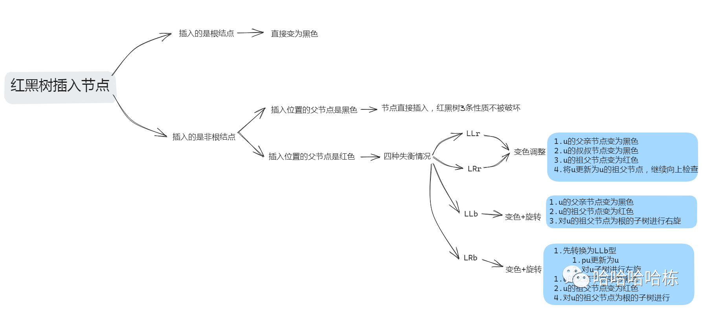
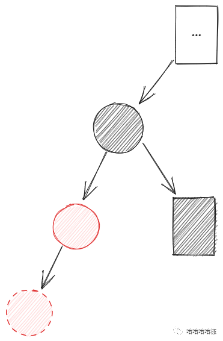
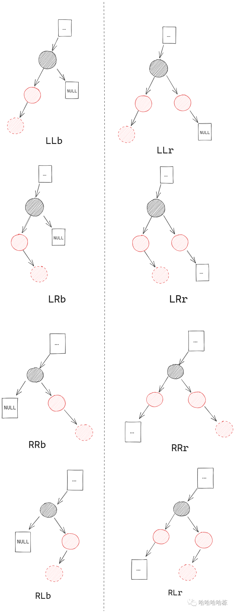
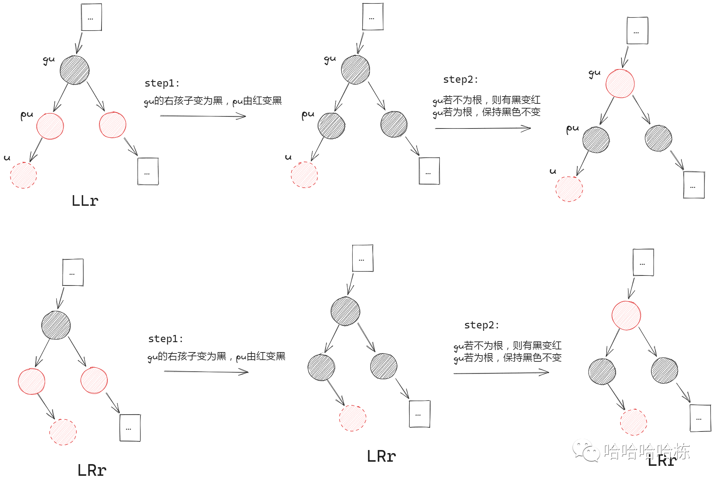
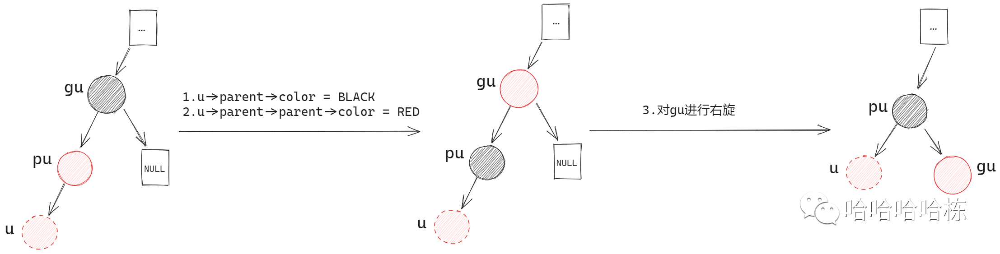
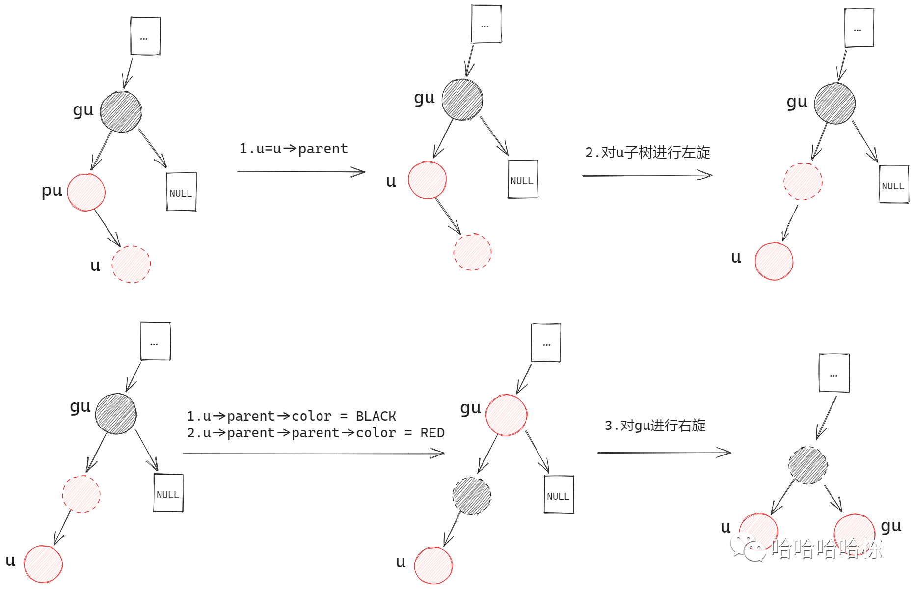
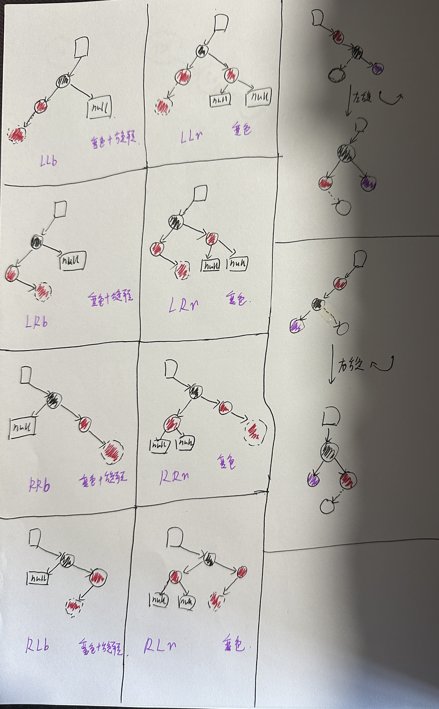
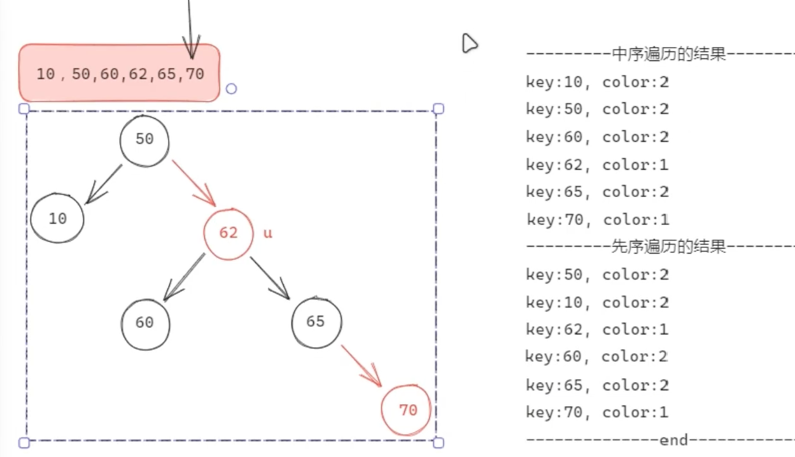

#  红黑树

## 1. 问题

## 2. 基础

### 2.1 外部资料

https://www.bilibili.com/video/BV1qG411a73p/?spm_id_from=333.999.0.0&vd_source=c6838f09fbfc9766e04f0c65ca196c42

### 2.2 基本定义

红黑树的节点要么是红色，要么是黑色。
红黑树是一种自平衡的二叉搜索树，具有如下3特性：

1. 根节点和所有外部节点（这里的外部节点，指NULL节点）都是黑色
2. 在根到外部节点的路径上，没有连续两个节点是红色
3. 在所有根到外部节点的路径上，黑色节点数目都相同

### 2.3 什么时候需要调整红黑树

当上面3条定义，有其中一条及以上不满足的时候就需要调整，通过调整将不满足红黑树定义的树，变成满足红黑树定义的树。

### 2.4 哪个最容易破坏

首先我们要讨论一个问题，在插入结点的时候，插入的结点颜色应该是红色还是黑色？

那我们就要想想，让新插入的结点是哪个颜色，最不容易破坏红黑树的三个定义？

**假设，我们插入的新节点颜色都是黑色。** 现在我们知道，在新结点插入之前，这棵树肯定是一棵红黑树，即肯定满足红黑树的3个定义。那也肯定满足定义3，即`在所有根到外部节点的路径上，黑色节点的数目都相同。` 好，那现在我们插入的新结点是黑色的，无论这个黑色节点在哪里，都会导致插入的那个结点到根节点的黑色节点数量比其他路径黑色节点多一个，也就是说，定义的第三个要求被破坏了。

**现在，我们再假设插入的新节点都是红色。** 同样的，插入红色节点前，这棵树是一棵红黑树。插入红色结点，会有两种情况：

1. 要插入的这个位置的父结点是红色，那定义第二点被破坏
2. 要插入这个位置的父节点是黑色，红黑树没有没破坏，不用调整

如果我们让插入的结点是黑色的，红黑树的结构一定被破坏，必然要进行树的调整。但是，如果我们让插入的所有结点都是红色的，那红黑树的结构有可能是不会被破坏的。所以，总体来说，让插入的所有结点都是红色，这样效率肯定会比让插入所有结点都是黑色效率要高。

### 2.5 优点和缺点

红黑树（Red-Black Tree）是一种自平衡的二叉搜索树，它在插入和删除节点时能够自动调整以保持树的平衡。红黑树在C++中通常用于实现高效的关联容器，如`std::map`和`std::set`。下面我将讨论红黑树的一些优点和缺点：

**优点：**

1. **自平衡性**：红黑树在插入和删除节点时会自动调整，确保树的深度始终保持对数级别。这保证了搜索、插入和删除操作的时间复杂度为O(log n)，其中n是树中节点的数量。
2. **性能稳定**：由于红黑树的自平衡特性，它在最坏情况下的性能仍然很好。这意味着在实际应用中，红黑树通常能够提供可预测的稳定性能。
3. **不需要频繁的完全重建**：与其他平衡树（如AVL树）相比，红黑树在插入和删除节点时的调整操作相对较少，从而减少了完全重建树的频率。
4. **用途广泛**：红黑树是一种通用数据结构，适用于多种应用场景，如关联数组、优先队列和时间序列数据等。

**缺点：**

1. **实现复杂**：红黑树的插入和删除操作涉及到多个复杂的步骤和情况处理，这使得它的实现相对困难。对于初学者来说，理解和实现红黑树可能需要花费更多的时间和精力。
2. **额外的空间开销**：每个红黑树节点需要存储额外的信息（如颜色），这增加了节点的空间开销。然而，在大多数情况下，这种额外的空间开销是可以接受的，因为它换来了更好的时间性能。
3. **不是最优的平衡树**：虽然红黑树在插入、删除和搜索操作中提供了很好的性能，但在某些特定场景下，其他平衡树（如AVL树或替罪羊树）可能会提供更好的性能。然而，这种差异通常在实际应用中并不明显。

总的来说，红黑树是一种非常强大且实用的数据结构，它在许多应用场景中都表现出色。尽管实现起来可能有些复杂，但一旦掌握，它将为你的算法和数据结构技能增添一笔宝贵的财富。

### 2.6 增删查改的效率

1. 创建（Create）/ 插入（Insert）：
   - 红黑树在插入新节点时，首先会按照二叉搜索树的规则找到合适的位置插入新节点（通常是作为叶子节点），然后调整树的结构以满足红黑树的性质。这个过程的时间复杂度是 O(log n)，因为需要先找到插入位置。插入后的调整（包括重新着色和旋转）也是在对数时间内完成的。
2. 读取（Read）/ 查找（Search）：
   - 查找操作在红黑树中是非常高效的，因为红黑树本质上是一种平衡的二叉搜索树。查找操作从根节点开始，沿着树向下遍历，直到找到目标节点或遍历到空节点（表示查找失败）。这个过程的时间复杂度也是 O(log n)。
3. 更新（Update）：
   - 更新操作在红黑树中通常是通过先查找需要更新的节点，然后修改该节点的值来实现的。如果更新不改变节点的排序位置（即值的大小关系不变），那么只需要修改节点的数据部分，不需要调整树的结构。这种情况下，更新的时间复杂度与查找相同，即 O(log n)。然而，如果更新改变了节点的排序位置，那么可能需要先删除旧节点，再插入新节点，这就涉及到了删除和插入的复杂度。
4. 删除（Delete）：
   - 删除操作在红黑树中相对复杂，因为删除节点可能会破坏红黑树的平衡性质。删除一个节点后，需要通过一系列的调整（包括重新着色和旋转）来恢复树的平衡。这个过程的时间复杂度也是 O(log n)，因为需要先找到要删除的节点，然后进行调整。

需要注意的是，虽然上述操作的理论时间复杂度都是 O(log n)，但在实际应用中，由于缓存局部性、分支预测等因素的影响，实际性能可能会有所不同。此外，红黑树的实现复杂度较高，相对于其他简单数据结构（如链表或未平衡的二叉搜索树），其常数因子可能较大，这在处理小规模数据时可能会表现得不太明显。因此，在选择数据结构时，需要根据具体的应用场景和需求进行权衡。

## 3. 结点的插入

 

### 3.1 插入结点整体分析

从上面的分析已经知道了，红黑树，所有插入的新结点都是红色的，所以，红黑树的插入会有这么几种情况。

- 插入前树空
  - 那么插入的这个结点就是根，根是黑色的，所以让这个结点是黑色的就行
- 插入位置的父结点是黑色
  - 正常插入，红黑树结构没有改变，不用调整
-  插入位置父结点是红色
  - **红黑树结构被改变，调整树**

### 3.2 红黑树被破坏的原因

前面两种情况都很好处理，核心是第三种情况。对于父节点是红色，对应的有那些小情况，这些小情况又该如何处理？

这里先简单脑补一下红色结点插入要调整的情况，以便我们对当前这个插入新结点的红黑树有更全面的认识。

 

我们看上面这个图，虚线画的红色结点就是我们要插入的新结点，我们现在知道，其父节点是红色的，那么必然，其父节点不是根，因为，根是黑色。那么必然，其祖父节点是黑色的，因为，虚线红色节点插入进来以前，这个树是一个正常的红黑树。好知道了这些，我们继续往下看。

#### 3.2.1 LLb型失衡 

 

这种情况被称为`LLb`型失衡，为什么这么把它叫这个名字呢`LLb`就是`left left black`的意思，我们来看为啥叫这个名字：

`LL(left left)`的解释：

+ 插入的红色结点，来自于当前最小不平衡子树的左子树`(left)`的左子树`(left)`

`b(black)`的解释：

+ 这个最小不平衡子树的右孩子结点（即插入结点的叔叔）为`b(black)`，当然，这个结点可以是黑色普通结点，也可以是NULL

#### 3.2.2 失衡归纳

 

注意，这里的实线方框表示，还有别的节点，但是我们不关心。带虚线的方框表示NULL空节点，当然，空节点也是黑色节点。

ok,我们现在将所有插入所导致的失衡已经罗列出来了，一共8种情况，我在他们中间花了一条线，左边都是`XXb`以b结尾，即要插入结点的叔叔都是`black`。右边都是`XXr`这种格式的，以r结尾，即要插入的结点的叔叔都是`red`。

为什么要将其分开呢，因为，左边和右边的调整方案不一样，左边即`XXb`要通过旋转+变色就可以调整，右边`XXr`只通过改变颜色来处理就可以。

总结一下：

-  `XXr`->变色调整
  -  即，要插入结点的叔叔是红色，通过变色来调整
- `XXb`->旋转调整+变色
  - 即，要插入结点的叔叔是黑色，通过旋转来调整

### 3.3 对失衡的处理办法

#### 3.3.1 XXr:变色调整

我们这里以`LLr`和`LRr`举例子，`RRr`和`RLr`的方法是对称类似的。为了方便描述，我们将新插入的结点叫做u，那其父结点就是`parent u`即`pu`，其祖父结点就是`grand u`即`gu`。

 

下面是修改方式的语言总结：

1. u的叔叔节点变为黑色
2. u的父亲节点变为黑色
3. u的祖父节点变为红色
4. u的祖父节点作为新的u进行向上层检查

ok,这样对于gu这个小子树来说就已经修改完毕了，但是有个问题，如果gu的父亲是红色的，那第二步经gu修改为红色以后，那岂不是又不平衡了，没关系，那我们将gu当做u，分析gu的父亲结点，祖父结点，再根据具体情况具体调整就行了。后面看代码会发现非常简单，一个while循环就搞定了。

同样的，我们通过上面的`LLr`和`LRr`可以发现他俩的调整情况是一样的。那同样`RRr`和`RLr`的调整情况也是一样的。所以，我们在具体代码实现的时候，颜色变换本质上就只有两种情况`LXr`和`RXr`。

#### 3.3.2 XXb:旋转+变色调整

ok，我们现在来说旋转。旋转对于LLb和LRb两种情况，RLb和RRb对称类似，逻辑对称，代码也对称。下面，我先来说LLb，然后再说LRb。为什么这么安排呢？因为，我们解决LRb的方案就是， 先把LRb转换为LLb，然后再对其进行处理。

##### 3.3.2.1 LLb

首先，LLb，回忆一下啥是LLb? 插入节点u的父节点是红色，u的祖父节点的另一个孩子，也就是u的叔叔是黑色，即为NULL。我们这里统一将叔叔节点称为y。然后，我们来看怎么处理，直接看图：

 

具体流程，用语言描述如下：

1. u的父节点颜色变为黑色
2. u的祖父节点颜色变为红色
3. 对u的祖父gu为根的子树进行右旋

通过上面的流程我们能发现，这个子树，在经过旋转和变色以后，黑色节点数量没有变化，同时，也解决了两个红色节点的问题，所以，不需要在往这个子树的上面去检查了。

##### 3.3.2.2 LRb

下面我们来看LRb，LRb的解决思路就是，通过一次旋转，将LRb转化为LLb，然后，再按照处理LLb的方式处理LRb即可。

直接看图，看看如何将其LRb转换为LLb吧。

 

下面用语言来简单描述下如何处理LRb情况：

1. 让u的父亲节点为u
2. 对u子树进行左旋（此时已经转换为LLb型）
3. 再进行LLb型处理
   1. u的父亲节点颜色变为黑色
   2. u的祖父节点颜色变为红色
   3. 对u的祖父节点gu为根的子树进行右旋

同样的，经过上面的操作以后，处理过的这个子树中黑色节点的数量没有发生改变，所以不需要去向上进行检查。

## 4. 结点的删除

## 5. 自我总结

 

## 6. 代码

[rbtree.c](https://github.com/niu0217/Documents/blob/main/C%2B%2B/datastructure/code/rbtree.c)

[rbtree.cpp](https://github.com/niu0217/Documents/blob/main/C%2B%2B/datastructure/code/rbtree.cpp)

 

