# C++动态链接Linux

## 1. 为什么要动态链接

### 1.1 内存和磁盘空间

静态链接对于计算机内存和磁盘的空间浪费非常严重。

举例：在静态链接下，程序`Program1`和`Program2`都用到了`Lib.o`这个模块，所以在链接输出的可执行文件`Program1`和`Program2`中都有一个`Lib.o`的副本。结构如下所示：

+ Program1
  + Lib.o
+ Program2
  + Lib.o

从上面的结构我们看出，当系统中存在大量的类似于`Lib.o`的被多个程序共享的目标文件时，其中很大一部分空间被浪费掉了。在静态链接中，C语言静态库是很典型的浪费空间的例子，还有其他数以千计的库如果都需要静态链接，那么空间浪费将无法想象。

### 1.2 程序开发和发布

静态链接对于程序的更新、部署和发布会带来比较多的麻烦。比如程序`Program1`使用的`Lib.o`是由一个第三方的厂商提供的，当该厂商更新了`Lib.o`的时候（比如修复了一个很小很小的Bug），那么`Program1`的厂商就需要拿到最新版的`Lib.o`，然后将其与`Program1.o`链接后，将新的`Program1`整个发布给用户。

这样的缺点很明显，即一旦程序中有任何模块更新，整个程序就要重新链接、发布给用户。

比如一个程序有`10000`个模块，每个模块`100MB`，那么每次更新任何一个模块，用户就必须重新获得这个`10000 * 100MB`的程序。如果程序都使用静态链接，那么通过网络来更新程序将会非常不便，因为一旦程序任何位置的一个小改动，都会导致整个程序重新下载。

### 1.3 动态链接

要解决空间浪费和更新困难这两个问题最简单的办法就是把程序的模块相互分割开来，形成独立的文件，而不再将它们静态地链接在一起。即，不对那些组成程序的目标文件进行链接，等到程序要运行时才进行链接。也就是说，把链接的这个过程推迟到了运行时再进行，这就是动态链接的基本思想。

举例：

+ 每次手机更新了系统之后都需要重新启动，因为有很多文件变动了，需要重新链接。当手机重启的时候，它就会重新链接修改的文件。
+ 更新了APP之后需要重启，因为需要重新链接。（我们不需要下载整个APP，只需要下载修改部分的目标文件，然后再重启的时候再进行链接即可）

假如我们保留`Program1.o`、`Program2.o`和`Lib.o`这三个目标文件。当我们要运行`Program1`这个程序的时候，系统首先加载`Program1.o`，当系统发现`Program1.o`用到了`Lib.o`，即`Program1.o`依赖于`Lib.o`，那么系统接着加载`Lib.o`，如果`Lib.o`或者`Program1.o`还依赖于其他目标文件，系统会按照这种方式将它们全部加载到内存。所有需要的目标文件加载完毕之后，如果依赖关系满足，即所有依赖的目标文件都存在于磁盘，系统开始进行链接工作。这个链接工作的原理和静态链接非常相似，包括符号解析、地址重定位等。完成这些步骤之后，系统开始吧控制权交给`Program1.o`的程序入口处，程序开始运行。

这时如果我们需要运行`Program2`，那么系统只需要加载`Program2.o`，而不需要重新加载`Lib.o`，因为内存中已经存在一份`Lib.o`的副本，系统要做的只是将`Program2.o`和`Lib.o`链接起来。

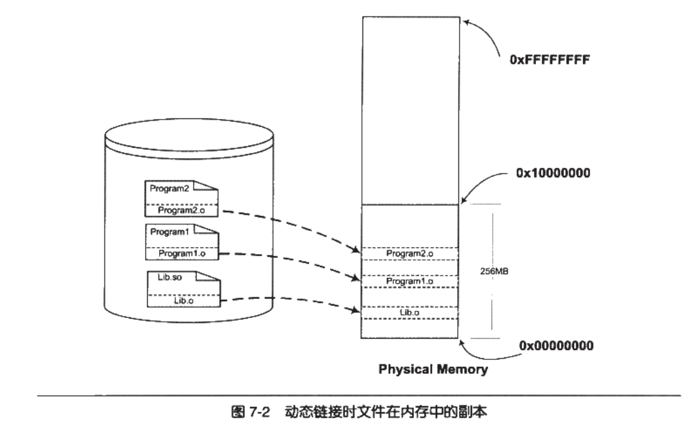 

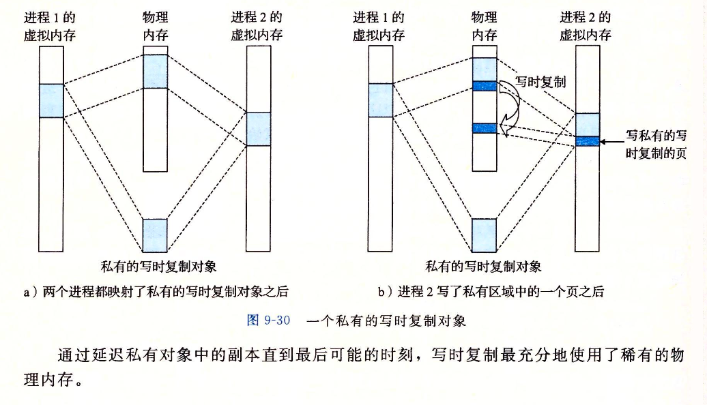 

图9-30解析：

+ 进程1：Program1（依赖于Lib.o）
+ 进程2：Program2（依赖于Lib.o）
+ 私有的写时复制对象：Lib.o

很明显，上面的这种做法解决了共享的目标文件多个副本浪费磁盘和内存空间的问题，可以看到，磁盘和内存中都只有一份`Lib.o`，而不是两份。另外在内存中共享一个目标文件模块的好处不仅仅是节约内存，它还可以减少物理页面的换入换出，也可以增加CPU缓存的命中率，因为不同进程间的数据和指令访问都集中在了同一个共享模块中。

上面的动态链接方案也可以使得程序的升级变得更加容易，当我们要升级程序库或程序共享的某个模块时，理论上只需要简单地将旧的目标文件覆盖掉，而无需将所有的程序再重新链接一遍。当程序下一次运行的时候，新版本的目标文件会被自动加载到内存并且链接起来，程序就完成了升级的目标。

当一个程序产品的规模很大的时候，往往会分割成多个子系统和多个模块，每个模块都由独立的小组开发，甚至会使用不同的编程语言。动态链接的方式使得开发过程中各个模块更加独立，耦合度更小，便于不同开发者和开发组织之间进行开发和测试。

### 1.4 程序可扩展性和兼容性

动态链接还有一个特点就是程序在运行时可以动态地选择加载各种程序模块，这个优点被后来人们用来制作程序的插件。

当某个公司开发完成了某个产品，它按照一定的规则制定好程序的接口，其他公司或者开发者可以按照这种接口来编写符合要求的动态链接文件。该产品程序可以动态地载入各种由第三方开发的模块，在程序运行时动态地链接，实现程序功能的扩展。

动态链接还可以加强程序的兼容性。一个程序在不同的平台运行时可以动态地链接到由操作系统提供的动态链接库，这些动态链接库相当于在程序和操作系统之间增加了一个中间层，从而消除了程序对不同平台之间依赖的差异性。比如操作系统A和操作系统B对于`printf()`的实现机制不同，如果我们的程序是静态链接的，那么程序需要分别链接成能够在A运行和B运行的两个版本并且分开发布；但是如果是动态链接，只要操作系统A和操作系统B都能提供一个动态链接库包含`printf()`，并且这个`printf()`使用相同的接口，那么程序只需要有一个版本，就可以在两个操作系统上运行，动态地选择相应地`printf()`的实现版本。这是理论上的，实际实现还是有不少问题。

动态链接的缺点：常见的一个问题是，当程序所依赖的某个模块更新后，由于新模块与旧模块之间的接口不兼容，导致了原有的程序无法运行。这个问题出现在早期的Windows中，因为它们缺少一种有效的共享库版本管理机制，使得用户经常出现新程序安装完之后，其他某个程序无法正常工作的现象，这个问题也被叫做“DLL Hell”。

### 1.5 动态链接的基本实现

动态链接的基本思想是把程序按照模块拆分成各个相对独立部分，在程序运行时才将它们链接在一起形成一个完整的程序，而不是像静态链接一样把所有的程序模块都链接成一个个单独的可执行文件。

动态链接涉及运行时的链接和多个文件的装载，必须要有操作系统的支持，因为动态链接的情况下，进程的虚拟地址空间的分布会比静态链接情况下更为复杂，还有一些存储管理、内存共享、进程线程等机制在动态链接下也会有一些微妙的变化。目前主流的操作系统几乎都支持动态链接这种方式，在Linux系统中，ELF动态链接文件被称为动态共享对象（DSO， Dynamic Shared Objects），简称共享对象，它们一般以`.so`为后缀。而在Windows系统中，动态链接文件被称为动态链接库（Dynamic Linking Library），它们通常就是我们平时很常见的以`.dll`为扩展名的文件。

从本质上讲，普通可执行程序和动态链接库中都包含指令和数据，这一点没有区别。在使用动态链接库的情况下，程序本身被分为了程序主要模块（Program1）和动态链接库（Lib.so），但实际上它们都可以看作是整个程序的一个模块，所以当我们提到程序模块时可以指程序主模块也可以指动态链接库。

在Linux中，常用的C语言库的运行库glibc，它的动态链接形式的版本保存在`/lib`目录下，文件名叫做`libc.so`。整个系统只保留一份C语言库的动态链接文件`libc.so`，而所有的C语言编写的、动态链接的程序都可以在运行时使用它。当程序被装载的时候，系统的动态链接器会将程序所需要的所有动态链接库（最基本的就是`libc.so`）装载到进程的地址空间，并且将程序中所有未决议的符号绑定到相应的动态链接库中，并进行重定位工作。

程序与`libc.so`之间真正的链接工作是由动态链接器完成的，而不是我们前面看到的静态链接器`ld`完成的。动态链接是把链接这个过程从本来的程序装载前被推迟到了装载的时候。动态链接会导致程序性能的一些损失，但是对动态链接的过程可以进行优化，比如延迟绑定（Lazy Binding）等方法，可以使得动态链接的性能损失尽可能地减小。

## 2. 简单的动态链接例子

```
ubuntu@niu0217:~/Dev/Test/dynamic_link$ tree
.
├── Lib.c
├── Lib.h
├── Program1.c
└── Program2.c

0 directories, 4 files
```

```c
/* ************************************************************************
> File Name:     Lib.h
> Author:        niu0217
> Created Time:  Thu 22 Feb 2024 11:46:12 AM CST
> Description:
 ************************************************************************/

#ifndef LIB_H
#define LIB_H

void foobar(int i);

#endif
```

```c
/* ************************************************************************
> File Name:     Lib.c
> Author:        niu0217
> Created Time:  Thu 22 Feb 2024 11:46:05 AM CST
> Description:
 ************************************************************************/

#include<stdio.h>

void foobar(int i) {
    printf("Printing form Lib.so %d\n", i);
}
```

```c
/* ************************************************************************
> File Name:     Program1.c
> Author:        niu0217
> Created Time:  Thu 22 Feb 2024 11:45:46 AM CST
> Description:
 ************************************************************************/

#include "Lib.h"

int main()
{
    foobar(1);
    return 0;
}
```

```c
/* ************************************************************************
> File Name:     Program2.c
> Author:        niu0217
> Created Time:  Thu 22 Feb 2024 11:45:53 AM CST
> Description:
 ************************************************************************/

#include "Lib.h"

int main()
{
    foobar(2);
    return 0;
}
```

制作动态库文件：

```bash
gcc -fPIC -shared -o Lib.so Lib.c
```

编译链接Program1和Program2：

```bash
gcc -o Program1 Program1.c ./Lib.so

gcc -o Program2 Program2.c ./Lib.so
```

此时的文件结构：

```
ubuntu@niu0217:~/Dev/Test/dynamic_link$ tree
.
├── Lib.c
├── Lib.h
├── Lib.so
├── Program1
├── Program1.c
├── Program2
└── Program2.c

0 directories, 7 files
```

在静态链接时，整个程序最终只有一个可执行文件，它是一个不可以分割的部分；但是在动态链接下，一个程序被分成了若干个文件，有程序的主要部分，即可执行文件（`Program1`）和程序所依赖的共享对象`Lib.so`，很多时候我们也把这些部分称为模块，即动态链接下的可执行文件和共享对象都可以看作是程序的一个模块。

当程序模块`Program1.c`被编译成了`Program1.o`时，编译器还不知道`foobar()`函数的地址。当链接器将`Program1.o`链接成可执行文件时，这时候链接器必须确定`Program1.o`中所引用的`foobar()`函数的性质。

+ 如果`foobar()`是一个定义于其他静态目标模块中的函数，那么链接器将会按照静态链接的规则，将`Program1.o`中的`foobar`地址引用重定位；
+ 如果`foobar()`是一个定义在某个动态共享对象中的函数，那么链接器就会把这个符号的引用标记为一个动态链接的符号，不对它进行地址重定位，把这个过程留到装载时再进行。

那么，链接器如何知道`foobar`的引用是一个静态符号还是一个动态符号？这实际上就是我们要用到`Lib.so`的原因。`Lib.so`中保存了完整的符号信息（因为运行时进行动态链接还需使用符号信息），把`Lib.so`也作为链接的输入文件之一，链接器在解析符号时就可以知道：`foobar`是一个定义在`Lib.so`的动态符号。这样链接器就可以对`foobar`的引用做特殊的处理，使它成为一个对动态符号的引用。

## 3. 地址无关代码

+ 共享对象在编译时不能假设自己在进程虚拟地址空间中的位置。

+ 可执行文件基本可以确定自己在进程虚拟地址空间中的位置，因为可执行文件往往是第一个被加载的文件，它可以选择一个固定空闲的地址。

装载时重定位是解决动态模块中有绝对地址引用的办法之一，但是它有一个很大的缺点是指令部分无法在多个进程之间共享，这样就失去了动态链接节省内存的一大优势。我们还需要有一种更好的办法解决共享对象指令中对绝对地址的重定位问题。我们的目的很简单，希望程序模块中共享的指令部分在装载时不需要因为装载地址的改变而改变，所以实现的基本想法就是把指令中那些需要被修改的部分分离出来，跟数据部分放在一起，这样指令部分就可以保持不变，而数据部分可以在每个进程中拥有一个副本。这种方案就是目前被称为地址无关代码（PIC Position-independent Code）的技术。

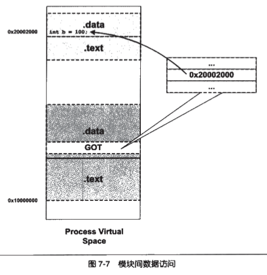 

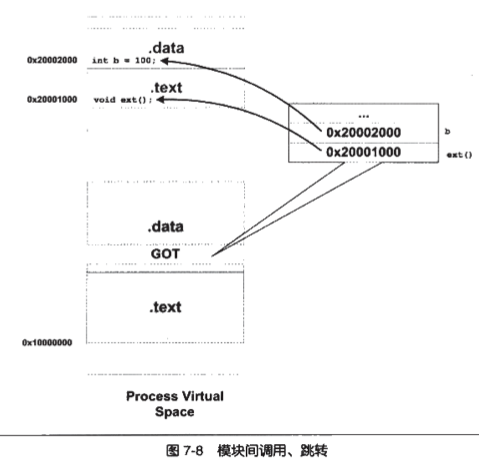 

## 4. 延迟绑定（PLT）

在动态链接下，程序模块之间包含了大量的函数引用（全局变量比较少，因为大量的全局变量会导致模块之间耦合度变大）。所以在程序开始执行前，动态链接会耗费不少时间用于解决模块之间的函数引用的符号的查找以及重定位。不过可以想象，在一个程序运行过程中，可能很多函数在程序执行完时都不会用到。比如一些错误处理函数或者是一些用户很少用到的功能模块。如果一开始就被所有的函数都链接实际上是一种浪费，所以ELF采用延迟绑定（Lazy Binding）的做法，基本思想就是当函数第一次被用到时才进行绑定（符号查找，重定位等），如果没有用到则不进行绑定。

所以程序开始执行时，模块间的函数调用都没有进行绑定，而是需要用到时才由动态链接器来负责绑定。这样的做法可以大大加快程序的启动速度，特别有利于一些有大量函数引用和大量模块的程序。

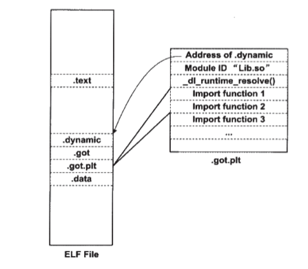 

## 5. 动态链接相关结构

在动态链接情况下，操作系统在装载完可执行文件之后不能直接将控制权交给可执行文件，因为我们知道可执行文件依赖于很多共享对象。

这个时候，可执行文件里对于很多外部符号的引用还是处于无效地址的状态，即还没有跟相应的共享对象中的实际位置链接起来。所以在映射完可执行文件之后，操作系统会先启动一个动态链接器（Dynamic Linker）。

在Linux下，动态链接器`ld.so`实际上是一个共享对象，操作系统同样通过映射的方式将它加载到进程的地址空间中。操作系统在加载完动态链接器之后，就将控制权交给动态链接器的入口地址（与可执行文件一样，共享对象也有入口地址）。当动态链接器得到控制权之后，它开始执行一系列自身的初始化操作，然后根据当前的环境参数，开始对可执行文件进行动态链接工作。当所有动态链接工作完成之后，动态链接器将控制权转交给可执行文件的入口地址，程序开始正式执行。

### 5.1 .interp段

动态链接器的位置既不是由系统配置指定，也不是由环境参数决定，而是由ELF可执行文件决定。

在动态链接的ELF可执行文件中，有一个专门的段叫做`.interp`段（interpreter解释器的缩写）。

```bash
ubuntu@niu0217:~/Dev/Test/dynamic_link$ objdump -s Program1

Program1:     file format elf64-x86-64

Contents of section .interp:
 0318 2f6c6962 36342f6c 642d6c69 6e75782d  /lib64/ld-linux-
 0328 7838362d 36342e73 6f2e3200           x86-64.so.2.
```

动态链接器在Linux下是Glibc的一部分，也就是属于系统库级别的，它的版本号往往跟系统中的Glibc库版本号一致。当系统中的Glibc库更新或者安装其他版本的时候，`/lib/ld-linux.so.2`这个软链接就会指向新的动态链接器，而可执行文件本身不需要修改`.interp`中的动态链接器路径来适应系统的升级。

### 5.2 .dynamic段

动态链接ELF中最重要的结构就是`.dynamic`段。这个段中保存了动态链接器所需要的基本信息：

+ 依赖于哪些共享对象
+ 动态链接符号表的位置
+ 动态链接重定位表的位置
+ 共享对象初始化代码的地址
+ 。。。

结构定义在`elf.h`中。

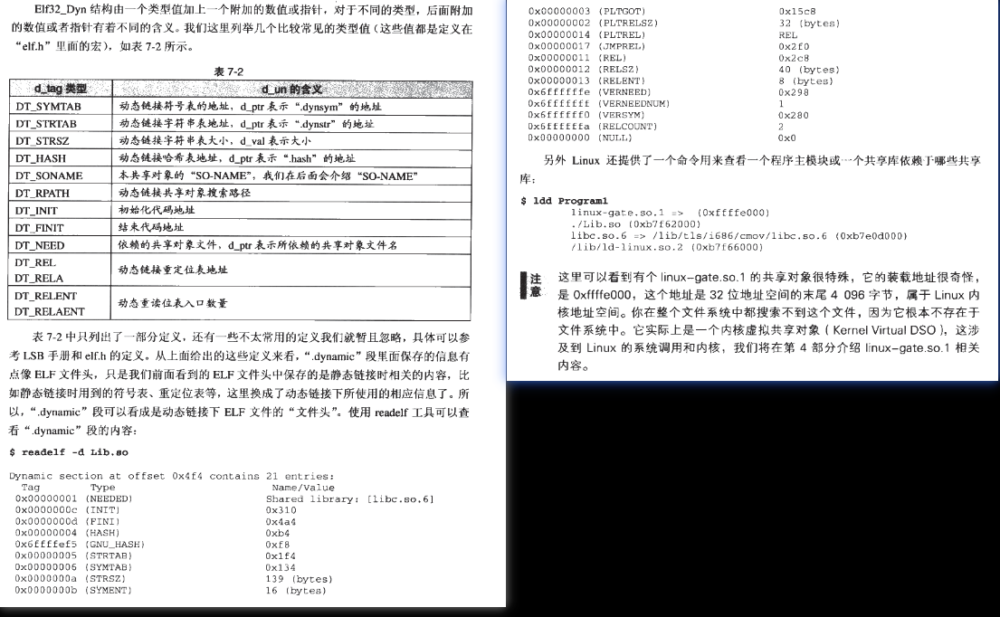 

### 5.3 动态符号表

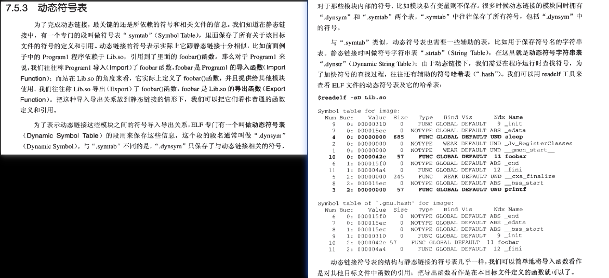 

```bash
ubuntu@niu0217:~/Dev/Test/dynamic_link$ readelf -sD Lib.so

Symbol table of `.gnu.hash' for image:
  Num Buc:    Value          Size   Type   Bind Vis      Ndx Name
    7   0: 0000000000001139    55 FUNC    GLOBAL DEFAULT  14 foobar
```

### 5.4 动态链接重定位表

```bash
ubuntu@niu0217:~/Dev/Test/dynamic_link$ readelf -r Lib.so

Relocation section '.rela.dyn' at offset 0x488 contains 7 entries:
  Offset          Info           Type           Sym. Value    Sym. Name + Addend
000000003e10  000000000008 R_X86_64_RELATIVE                    1130
000000003e18  000000000008 R_X86_64_RELATIVE                    10f0
000000004028  000000000008 R_X86_64_RELATIVE                    4028
000000003fe0  000100000006 R_X86_64_GLOB_DAT 0000000000000000 _ITM_deregisterTMClone + 0
000000003fe8  000300000006 R_X86_64_GLOB_DAT 0000000000000000 __gmon_start__ + 0
000000003ff0  000400000006 R_X86_64_GLOB_DAT 0000000000000000 _ITM_registerTMCloneTa + 0
000000003ff8  000600000006 R_X86_64_GLOB_DAT 0000000000000000 __cxa_finalize@GLIBC_2.2.5 + 0

Relocation section '.rela.plt' at offset 0x530 contains 2 entries:
  Offset          Info           Type           Sym. Value    Sym. Name + Addend
000000004018  000200000007 R_X86_64_JUMP_SLO 0000000000000000 printf@GLIBC_2.2.5 + 0
000000004020  000500000007 R_X86_64_JUMP_SLO 0000000000000000 sleep@GLIBC_2.2.5 + 0
```

```bash
ubuntu@niu0217:~/Dev/Test/dynamic_link$ readelf -S Lib.so
There are 30 section headers, starting at offset 0x37f8:

Section Headers:
  [Nr] Name              Type             Address           Offset
       Size              EntSize          Flags  Link  Info  Align
  [ 0]                   NULL             0000000000000000  00000000
       0000000000000000  0000000000000000           0     0     0
  [ 1] .note.gnu.propert NOTE             00000000000002a8  000002a8
       0000000000000020  0000000000000000   A       0     0     8
  [ 2] .note.gnu.build-i NOTE             00000000000002c8  000002c8
       0000000000000024  0000000000000000   A       0     0     4
  [ 3] .gnu.hash         GNU_HASH         00000000000002f0  000002f0
       0000000000000024  0000000000000000   A       4     0     8
  [ 4] .dynsym           DYNSYM           0000000000000318  00000318
       00000000000000c0  0000000000000018   A       5     1     8
  [ 5] .dynstr           STRTAB           00000000000003d8  000003d8
       000000000000007f  0000000000000000   A       0     0     1
  [ 6] .gnu.version      VERSYM           0000000000000458  00000458
       0000000000000010  0000000000000002   A       4     0     2
  [ 7] .gnu.version_r    VERNEED          0000000000000468  00000468
       0000000000000020  0000000000000000   A       5     1     8
  [ 8] .rela.dyn         RELA             0000000000000488  00000488
       00000000000000a8  0000000000000018   A       4     0     8
  [ 9] .rela.plt         RELA             0000000000000530  00000530
       0000000000000030  0000000000000018  AI       4    23     8
  [10] .init             PROGBITS         0000000000001000  00001000
       000000000000001b  0000000000000000  AX       0     0     4
  [11] .plt              PROGBITS         0000000000001020  00001020
       0000000000000030  0000000000000010  AX       0     0     16
  [12] .plt.got          PROGBITS         0000000000001050  00001050
       0000000000000010  0000000000000010  AX       0     0     16
  [13] .plt.sec          PROGBITS         0000000000001060  00001060
       0000000000000020  0000000000000010  AX       0     0     16
  [14] .text             PROGBITS         0000000000001080  00001080
       00000000000000f0  0000000000000000  AX       0     0     16
  [15] .fini             PROGBITS         0000000000001170  00001170
       000000000000000d  0000000000000000  AX       0     0     4
  [16] .rodata           PROGBITS         0000000000002000  00002000
       0000000000000019  0000000000000000   A       0     0     1
  [17] .eh_frame_hdr     PROGBITS         000000000000201c  0000201c
       000000000000002c  0000000000000000   A       0     0     4
  [18] .eh_frame         PROGBITS         0000000000002048  00002048
       0000000000000094  0000000000000000   A       0     0     8
  [19] .init_array       INIT_ARRAY       0000000000003e10  00002e10
       0000000000000008  0000000000000008  WA       0     0     8
  [20] .fini_array       FINI_ARRAY       0000000000003e18  00002e18
       0000000000000008  0000000000000008  WA       0     0     8
  [21] .dynamic          DYNAMIC          0000000000003e20  00002e20
       00000000000001c0  0000000000000010  WA       5     0     8
  [22] .got              PROGBITS         0000000000003fe0  00002fe0
       0000000000000020  0000000000000008  WA       0     0     8
  [23] .got.plt          PROGBITS         0000000000004000  00003000
       0000000000000028  0000000000000008  WA       0     0     8
  [24] .data             PROGBITS         0000000000004028  00003028
       0000000000000008  0000000000000000  WA       0     0     8
  [25] .bss              NOBITS           0000000000004030  00003030
       0000000000000008  0000000000000000  WA       0     0     1
  [26] .comment          PROGBITS         0000000000000000  00003030
       000000000000002b  0000000000000001  MS       0     0     1
  [27] .symtab           SYMTAB           0000000000000000  00003060
       00000000000004f8  0000000000000018          28    46     8
  [28] .strtab           STRTAB           0000000000000000  00003558
       0000000000000192  0000000000000000           0     0     1
  [29] .shstrtab         STRTAB           0000000000000000  000036ea
       000000000000010d  0000000000000000           0     0     1
Key to Flags:
  W (write), A (alloc), X (execute), M (merge), S (strings), I (info),
  L (link order), O (extra OS processing required), G (group), T (TLS),
  C (compressed), x (unknown), o (OS specific), E (exclude),
  l (large), p (processor specific)
```

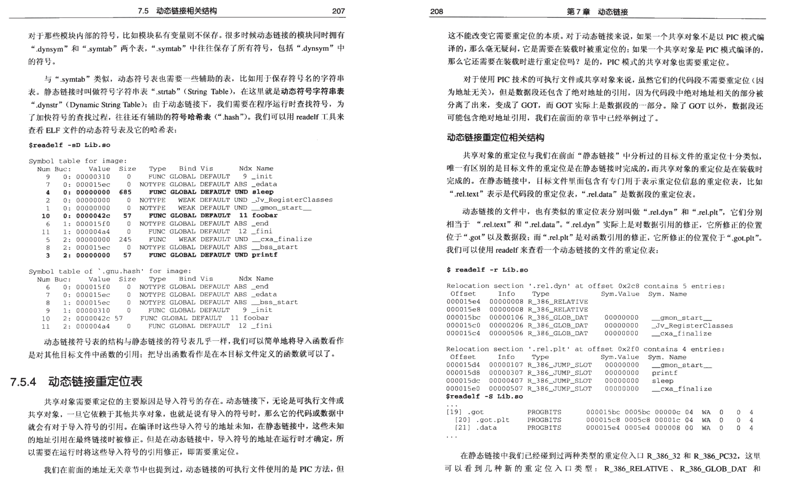 

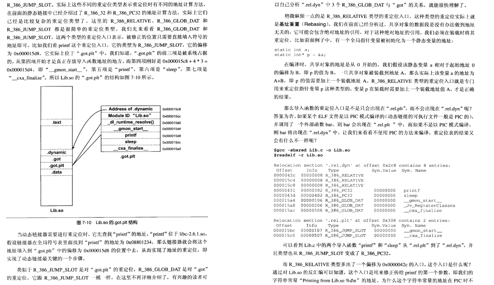 

 

### 5.5 动态链接时进程堆栈初始化信息

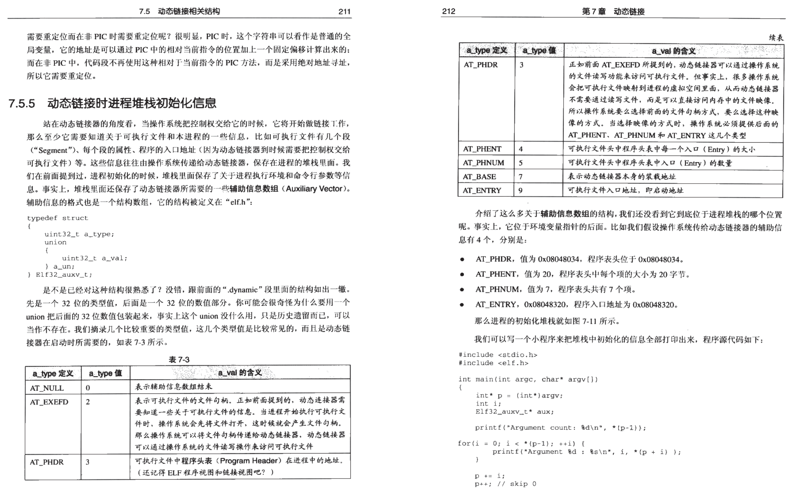 

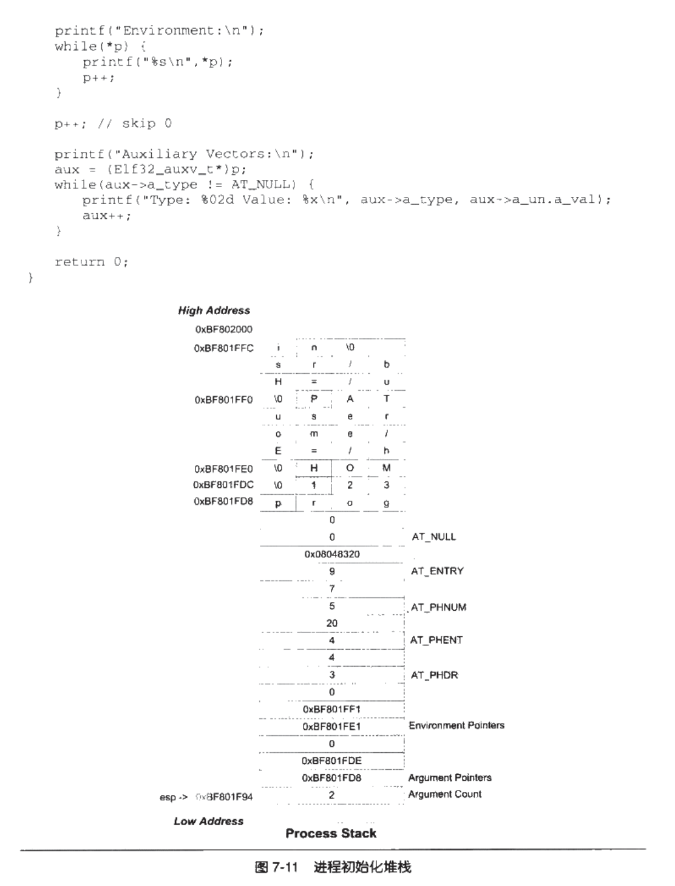  


## 6. 动态链接的步骤和实现

### 6.1 动态链接器自举

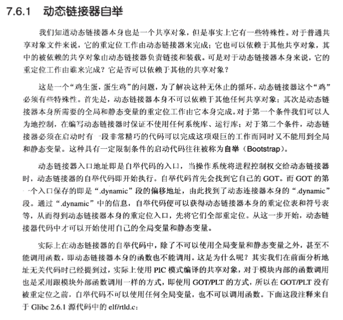 

### 6.2 装载共享对象

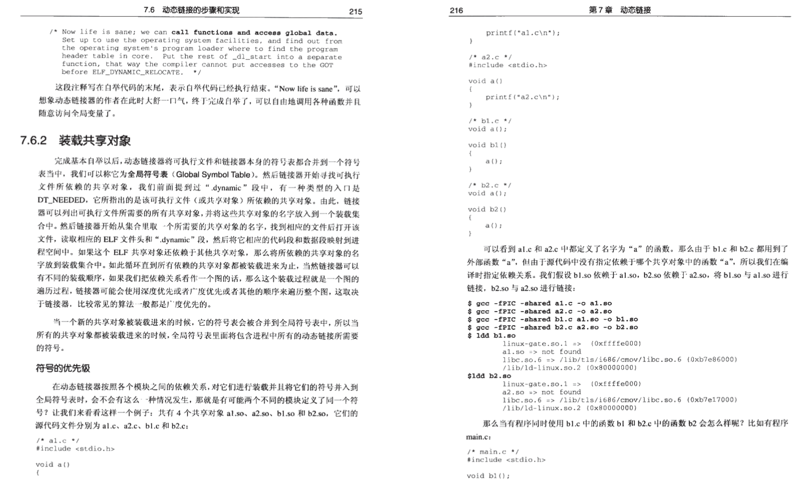 

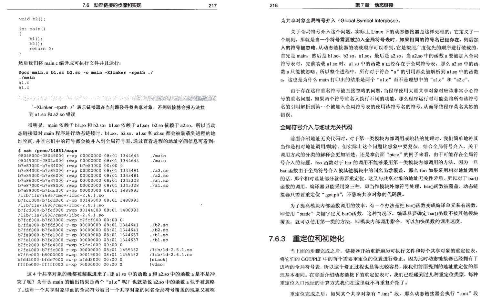 

### 6.3 重定位和初始化

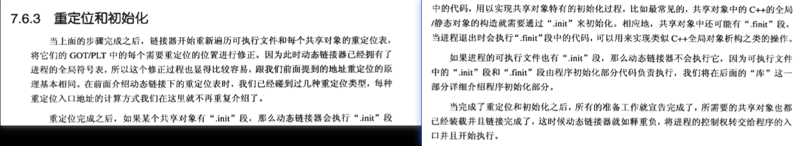 

### 6.4 Linux动态链接器实现

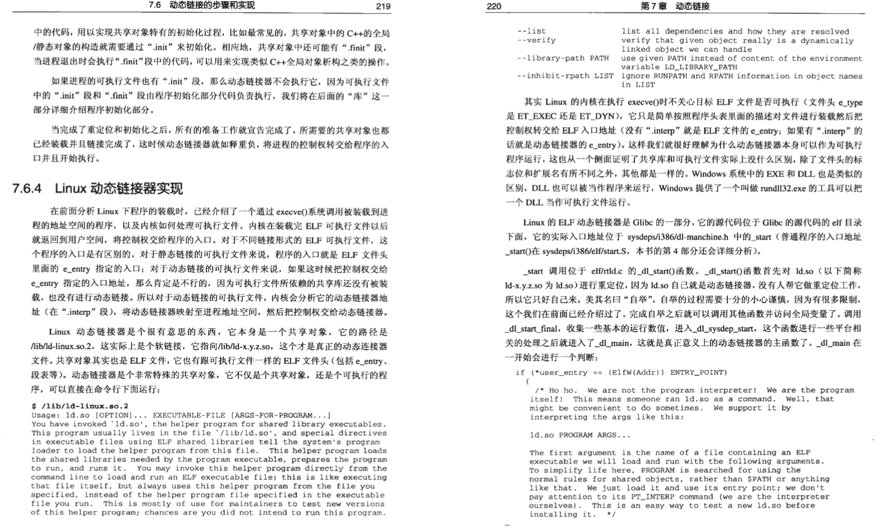 

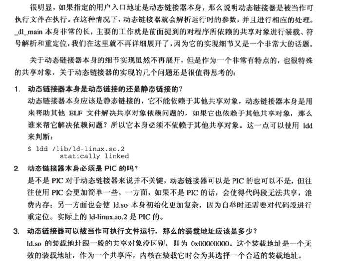 

## 7. 显式运行时链接

[从应用程序中加载和链接共享库.md](https://github.com/niu0217/Documents/blob/main/C%2B%2B/base/link/从应用程序中加载和链接共享库.md)