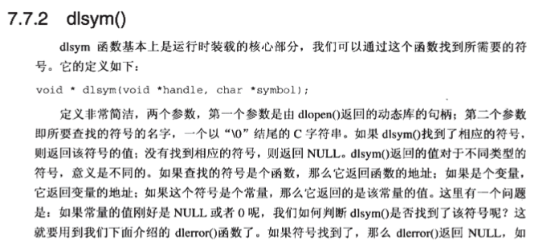

# 从应用程序中加载和链接共享库

## 1. 制作动态库

### 1.1 需要的文件

文件结构：

```
include/
└── my_vector.h
dynamic_library/
├── addvec.c
├── makefile
└── multvec.c
```

#### include

```c++
//my_vector.h

#include<stdlib.h>
#include<stdio.h>

void addvec(int *x, int *y, int *z, int n);
void multvec(int *x,int *y, int *z, int n);
```

#### dynamic_library

```c++
//addvec.c

#include "../include/my_vector.h"

int add_cnt = 0;

void addvec(int *x, int *y, int *z, int n) {
    int i;
    add_cnt++;
    for(i = 0; i < n; i++) {
        z[i] = x[i] + y[i];
    }
}
```

```c++
//multvec.c

#include "../include/my_vector.h"

int mult_cnt = 0;

void multvec(int *x,int *y, int *z, int n) {
    int i;
    mult_cnt++;
    for(i = 0; i < n; i++) {
        z[i] = x[i] + y[i];
    }
}
```

```makefile
# makefile
# 定义所需的C编译器和链接器
CC = gcc
LD = $(CC)

# 定义源文件和目标文件
SOURCES = multvec.c addvec.c
OBJECTS = $(SOURCES:.c=.o)
OUTPUT = libvector.so

# 定义CFLAGS LDFLAGS HEAD_FLAGS
CFLAGS = -fPIC -Wall -Wextra -g
LDFLAGS = -shared
HFLAGS = -I../include  #指定需要包含的头文件路径


# 默认目标
all: $(OUTPUT)

# 编译目标对象文件
%.o: %.c my_vector.h
	$(CC) $(CFLAGS) $(HFLAGS) -c $< -o $@

# 链接目标动态库
$(OUTPUT): $(OBJECTS)
	$(LD) $(LDFLAGS) -o $@ $^

# 清理目标文件和生成的动态库
clean:
	rm $(OBJECTS) $(OUTPUT)
```

### 1.2 开始制作

进入文件目录：dynamic_library，执行命令make。最后的文件结构：

```
include/
└── my_vector.h
dynamic_library/
├── addvec.c
├── addvec.o
├── libvector.so
├── makefile
├── multvec.c
└── multvec.o
```

## 2. 简单使用动态库

### 2.1 需要的文件

文件结构：

```
include/
└── my_vector.h
dynamic_library/
├── addvec.c
├── addvec.o
├── libvector.so
├── makefile
├── multvec.c
└── multvec.o
test_dynamic_library/
├── main.c
└── makefile
```

#### 步骤1中的文件

```
include/
└── my_vector.h
dynamic_library/
├── addvec.c
├── addvec.o
├── libvector.so
├── makefile
├── multvec.c
└── multvec.o
```

#### test_dynamic_library

```c++
//main.c

#include<stdio.h>
#include "../include/my_vector.h"

int x[2] = {1, 2};
int y[2] = {3, 4};
int z[2];

int main()
{
    addvec(x, y, z, 2);
    printf("z = [%d %d]\n", z[0], z[1]);
    return 0;
}
```

```makefile
# makefile
# 定义所需的C编译器和链接器
CC = gcc
LD = $(CC)

# 定义源文件和目标文件
SOURCES = main.c
OBJECTS = $(SOURCES:.c=.o)
EXECUTABLE = main

# 定义CFLAGS LDFLAGS HEAD_FLAGS
CFLAGS = -Wall -g
LDFLAGS = -L../dynamic_library -lvector
HFLAGS = -I../include

# 默认目标
all: $(EXECUTABLE)

# 编译目标对象文件
%.o: %.c
	$(CC) $(CFLAGS) $(HFLAGS) -c $< -o $@

# 链接目标可执行文件
$(EXECUTABLE): $(OBJECTS)
	$(LD) -o $@ $^ $(LDFLAGS)

# 清理目标文件和生成的可执行文件
clean:
	rm $(OBJECTS) $(EXECUTABLE)
```

### 2.2 开始使用

进入test_dynamic_library目录，执行命令make。结果如下：

```
test_dynamic_library/
├── main
├── main.c
├── main.o
└── makefile
```

然后执行命令：`./main`

**执行失败显示找不到动态库的解决方案：**

终端执行命令：

```bash
#必须是绝对路径
LD_LIBRARY_PATH=/home/ubuntu/Dev/MyLib/dynamic_library/
export LD_LIBRARY_PATH
```

然后再执行`make`命令。成功

可以通过

```bash
echo $LD_LIBRARY_PATH
```

查看`LD_LIBRARY_PATH`变量的值。

**动态库的搜索路径：**

- 1.编译目标代码时指定的动态库搜索路径;
- 2.环境变量`LD_LIBRARY_PATH`指定的动态库搜索路径；
- 3.配置文件`/etc/ld.so.conf`中指定的动态库搜索路径；
- 4.默认的动态库搜索路径`/lib`
- 5.默认的动态库搜索路径 `/usr/lib`。

## 3. 从应用程序中加载动态库

### 3.1 需要的文件

文件结构：

```
include/
└── my_vector.h
dynamic_library/
├── addvec.c
├── addvec.o
├── libvector.so
├── makefile
├── multvec.c
└── multvec.o
loadso/
├── dll.c
└── makefile
```

#### 步骤1中的文件

```
include/
└── my_vector.h
dynamic_library/
├── addvec.c
├── addvec.o
├── libvector.so
├── makefile
├── multvec.c
└── multvec.o
```

#### loadso

```c++
//dll.c

#include<stdio.h>
#include<stdlib.h>
#include<dlfcn.h>

int x[2] = {1, 2};
int y[2] = {3, 4};
int z[2];

int main()
{
    void *handle;
    void (*addvec)(int *, int *, int *, int);
    char *error;

    //加载动态库libvector.so,返回一个指向文件libvector.so的句柄
    //RTLD_LAZY: 该参数指示链接器推迟符号解析直到执行来自库中的代码。
    handle = dlopen("../dynamic_library/libvector.so", RTLD_LAZY);
    if(!handle) {
        fprintf(stderr, "%s\n", dlerror());
        exit(1);
    }

    //如果函数addvec在句柄handle指向的动态库文件中存在，
    //就返回一个函数指针指向它
    addvec = dlsym(handle, "addvec");
    if((error = dlerror()) != NULL) {
        fprintf(stderr, "%s\n", error);
        exit(1);
    }

    //调用函数addvec,它来自于handle句柄指向的动态库中
    addvec(x, y, z, 2);
    printf("z = [%d %d]\n", z[0], z[1]);

    //卸载handle句柄指向的动态库
    if(dlclose(handle) < 0) {
        fprintf(stderr, "%s\n", dlerror());
        exit(1);
    }

    return 0;
}
```

```makefile
all:
	gcc -rdynamic -o dll dll.c -ldl
```

命令：`gcc -rdynamic -o dll dll.c -ldl`

这条命令是使用 GCC 编译器编译一个名为 `dll.c` 的源文件，并生成一个名为 `dll` 的可执行文件。以下是命令中各个选项的含义：

- `gcc`: 这是 GNU Compiler Collection（GCC）的命令，用于编译 C、C++ 等语言的源代码。
- `-rdynamic`: 这个选项告诉链接器将所有符号（包括未引用的全局符号）添加到动态符号表中。这在某些情况下可能有用，例如当你希望在运行时通过 dlopen/dlsym 等函数访问程序中的符号时。
- `-o dll`: 这个选项指定输出的可执行文件名为 `dll`。
- `dll.c`: 这是需要编译的源文件。
- `-ldl`: 这是一个链接器选项，告诉链接器链接 `dl` 库。`dl` 是一个 C 库，提供了动态加载和操作共享库（如 `.so` 文件）的函数，如 dlopen、dlsym 和 dlclose 等。

总的来说，这个命令是用来编译一个可以动态加载和操作其他共享库的 C 程序。注意，这个命令并不直接生成一个共享库（`.so` 文件），而是生成一个可执行文件。如果你的目标是生成一个共享库，那么应该使用 `-shared` 选项代替 `-rdynamic`，并且通常不需要链接 `dl` 库。

### 3.2 开始使用

+ 进入目录：loadso/。

+ 指向命令make，生成dll文件。

+ 然后：`./dll`

## 4. 函数解析

程序可以通过下面4个函数对动态库进行操作。这几个API的实现是在`/lib/libdl.so.2`里面，它们的声明和相关常量被定义在系统标准头文件`<dlfcn.h>`。

### 4.1 dlopen

 

 

### 4.2 dlsym

 

 

### 4.3 dlerror

 

### 4.4 dlclose

 

### 4.5 小例子

 
