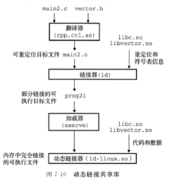
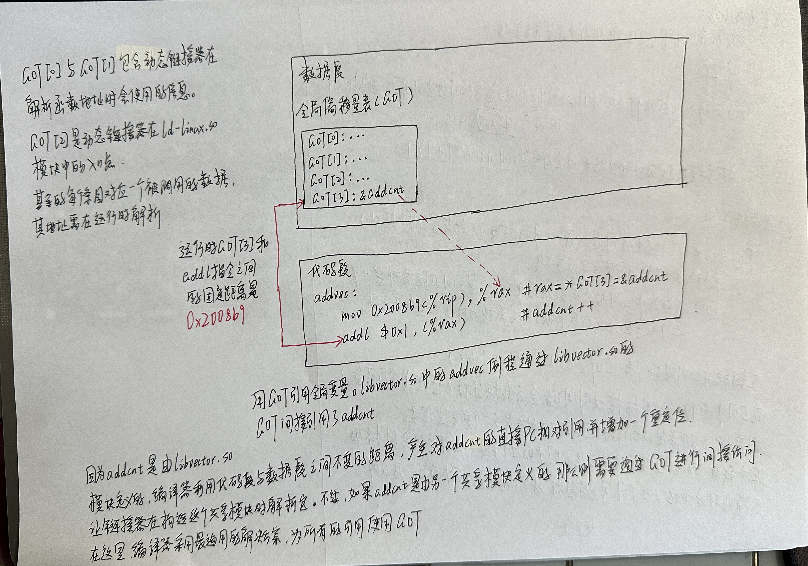
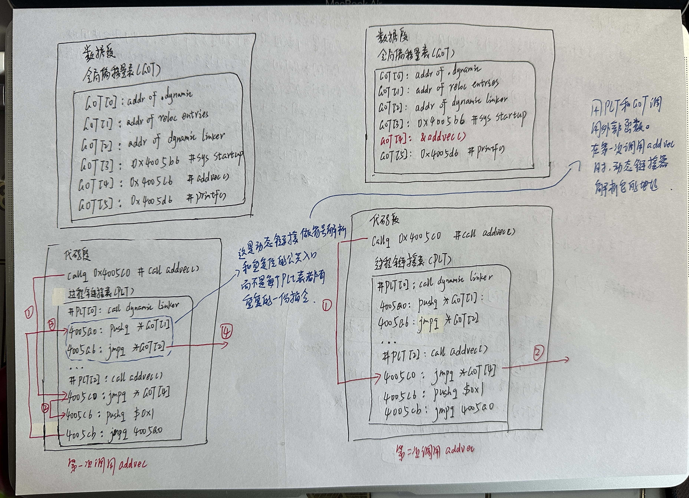

# 位置无关代码

## 1. 问题

### 1.1 Linux中共享库的代码段和数据段在每个进程中是共享的吗？

+ 在Linux中，共享库的代码段在每个进程中是共享的，这是通过内存映射的方式实现的。当一个动态链接库（共享库）被加载到进程的地址空间中时，该库的代码段在物理内存中只有一份副本，然后所有使用该共享库的进程都会共享这个相同的代码段。

+ 相反，共享库的数据段在每个进程中是独立的，因为数据段包含了全局数据、已初始化的静态变量等，这些数据在每个进程中都有自  己独立的副本。这是因为每个进程的数据段在逻辑上都是相互隔离的，以保障各个进程的数据独立性和安全性。

+ 因此，可以说在Linux中共享库的代码段是共享的，但数据段是进程私有的。这种机制既能够节约内存，又能够确保不同进程的数据独立性。

### 1.2 Linux中的PLT存在于共享库文件还是可执行文件中

+ 在Linux中，PLT（Procedure Linkage Table，过程链接表）存在于共享库文件（.so文件）中，而不是可执行文件中。

+ PLT是一个动态链接的概念，它用于在运行时解析共享库中的函数调用。当一个程序调用共享库中的函数时，PLT提供了一个间接的方式来实现动态链接。当程序第一次调用一个共享库中的函数时，PLT的一部分代码会被执行，此时动态链接器（如ld-linux.so）会负责将函数的真正地址填充到PLT中，下次直接跳转到这个地址，从而避免了重复的符号解析过程。

+ 因此，PLT是共享库中的一个特定区域，它和动态链接相关，用于进行符号解析和链接迟滞（lazy binding）。

### 1.3 Linux中的GOT存在于共享库文件还是可执行文件中

+ 在Linux中，GOT（Global Offset Table，全局偏移表）存在于可执行文件和共享库文件中。 GOT是用来存放全局变量和静态变量的地址的表，它包含了程序中所有需要进行全局偏移的变量的地址，在程序加载时会被动态链接器（如ld-linux.so）填充正确的地址。

+ 对于可执行文件，GOT中存放了程序自身的全局变量和静态变量的地址。

+ 对于共享库文件，GOT中存放了共享库本身的全局变量和静态变量的地址。 当这个共享库被一个程序加载时，动态链接器会为这个共享库的GOT填充正确的地址。

+ 因此，GOT既存在于可执行文件中，也存在于共享库文件中，用于存放全局偏移的变量地址，并在加载时由动态链接器进行填充。

### 1.4 C++的链接阶段和加载阶段的不同点

 

在 C++ 中，链接阶段和加载阶段是程序构建的两个不同的阶段，它们在构建可执行文件或者共享库时起到不同的作用。

链接阶段：

1. **作用**：链接阶段是将编译器产生的目标文件（如 .o 文件）合并在一起，创建可执行文件或共享库的过程。在这个阶段，全局符号解析、重定位（地址的修正）、符号解析等操作被执行。
2. **主要任务**：主要任务包括将不同的目标文件中的符号（如函数、变量等）解析为地址，并对这些符号的引用进行重定位，确保所有的符号都可以正确链接，形成一个完整的可执行文件或者共享库。

加载阶段：

1. **作用**：加载阶段是将可执行文件或共享库加载到内存中并准备执行的过程。在这个阶段，操作系统负责将程序加载到内存中，并进行地址空间的分配、页表的建立等操作。
2. **主要任务**：主要任务是将程序的二进制代码和数据加载到内存中的适当位置，然后进行一些必要的准备工作，如初始化静态变量、分配内存空间，最终使得程序能够被CPU执行。

因此，链接阶段和加载阶段都是构建可执行文件或共享库时必不可少的步骤，但它们的职责和工作内容是不同的。链接阶段确保所有的符号引用能够被正确解析和定位，组成最终的可执行文件或共享库；而加载阶段是将可执行文件或共享库加载到内存中，准备执行。

## 2. 代码

 

## 3. 分析

使用延迟绑定的动机：

+ 对于一个像`libc.so`这样的共享库输出的成百上千的函数中，一个典型的应用程序只会使用其中很少的一部分。把函数地址的解析推迟到它实际调用的地方，能避免动态链接器在加载时进行成百上千个其实不需要的重定位。第一次调用过程的运行时开销很大，但是其后的每次调用都只会花费一条指令和一个间接的内存引用。

 

 

 

  

 

## 4. 外部资料

+ 聊聊Linux动态链接中的PLT和GOT（１）——何谓PLT与GOT

https://blog.csdn.net/linyt/article/details/51635768

+ 聊聊Linux动态链接中的PLT和GOT（２）——延迟重定位

https://linyt.blog.csdn.net/article/details/51636753

+ 聊聊Linux动态链接中的PLT和GOT（３）——公共GOT表项

https://linyt.blog.csdn.net/article/details/51637832

+ 聊聊Linux动态链接中的PLT和GOT（4）—— 穿针引线

https://linyt.blog.csdn.net/article/details/51893258

