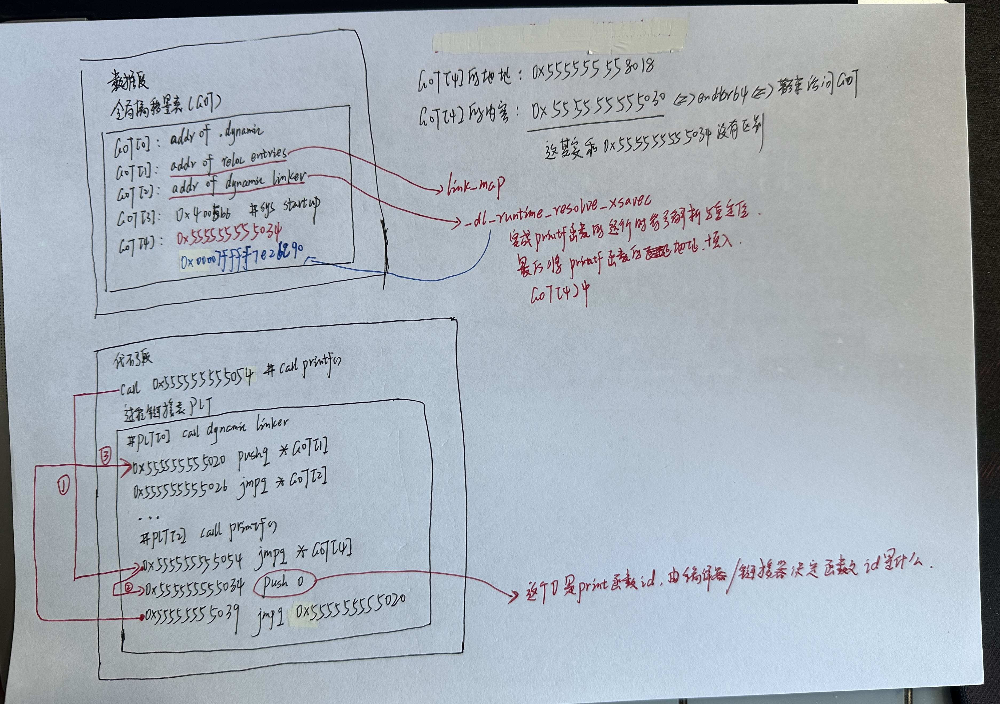

# 使用GDB解析GOT和PLT

## 0. 参考文章

+ 通过GDB学透PLT与GOT

https://blog.csdn.net/qfanmingyiq/article/details/124361747

## 1. 基础知识

### 1.1 什么是linux-vdso.so.1

`linux-vdso.so.1` 是 Linux 中的一个特殊的共享库，通常不对应于任何物理文件，而是内核运行时创建的一个虚拟动态共享对象（VDSO）。VDSO 主要包含一些特定的系统调用，例如获取当前时间戳、获取系统调用的精确时间等，这些系统调用在用户空间执行，性能比传统的系统调用要高。

从 `linux-vdso.so.1 (0x00007ffd871a2000)` 可以得知，`linux-vdso.so.1` 被映射到了进程的内存空间，起始地址是 `0x00007ffd871a2000`。

在 64 位的 Linux 系统中，VDSO 是通过内核将这一段特殊的共享库的代码映射进每个进程的地址空间的，这样用户态的程序就能够不通过陷入内核到内核态来执行一些特定的系统调用，例如获取时间戳。通过VDSO中的优化过的代码，用户态程序可以更高效地执行这些系统调用。进程在每次启动时，内核将会根据需要将 VDSO 映射到用户进程的地址空间中。

总的来说，VDSO 的目的是让用户空间的程序可以高效地执行一些系统调用，而无需陷入内核态。这能够提高系统调用的性能，因为它们以更低的代价在用户空间执行。

### 1.2 什么是ld-linux-x86-64.so.2

`ld-linux-x86-64.so.2` 是 Linux 系统上的动态链接器，它在程序的加载和执行过程中起着关键作用。这个动态链接器是用于运行 64 位 x86 架构的可执行文件的。Linux 系统的动态链接器的任务包括加载程序所需的共享库（如 libc.so）并解析程序使用的符号。它使得动态链接的程序在加载和运行时可以按需加载共享库，并且解析动态链接，确保程序能够正常执行。

`/lib64/ld-linux-x86-64.so.2` 显示了动态链接器所在的位置，`(0x00007fde27b39000)` 则表示了该动态链接器在内存中的起始地址。

当一个程序被执行时，操作系统会将动态链接器映射到这个起始地址，以便程序能够开始执行并且可以正确地进行动态链接。

### 1.3 什么是libc.so.6

解释：`libc.so.6 => /lib/x86_64-linux-gnu/libc.so.6 (0x00007fde2792e000)`

这个输出中显示了一个共享库 `libc.so.6` 的信息：

- **`libc.so.6`** 是 C标准库在Linux系统上的主要实现，其包含了许多基本的系统功能，例如内存分配、输入输出、字符串处理等。
- **`/lib/x86_64-linux-gnu/libc.so.6`** 是 `libc.so.6` 文件的路径，这是共享库文件的实际位置。
- **`(0x00007fde2792e000)`** 是动态链接器将 `libc.so.6` 映射到进程内存空间的起始地址。

综合起来，这条信息表明在进程执行时，`libc.so.6` 被动态链接器映射到了地址 `0x00007fde2792e000`，从而使得程序能够在执行时访问 C 标准库的功能。

## 2. 代码

源代码：

```c
//编译指令 gcc -o test test.c -zlazy
//zlazy是启用延迟绑定。部分发行版本连接器直接程序加载的时候会进行绑定so函数
#include <stdio.h>
int main(){
	printf("hello %d\n",23);
}
```

编译并链接：

```bash
ubuntu@niu0217:~/Dev/Test$ gcc -o test test.c -zlazy
ubuntu@niu0217:~/Dev/Test$ ./test
hello 23
ubuntu@niu0217:~/Dev/Test$ ldd test
	linux-vdso.so.1 (0x00007fff66bd9000)
	libc.so.6 => /lib/x86_64-linux-gnu/libc.so.6 (0x00007f0683fbb000)
	/lib64/ld-linux-x86-64.so.2 (0x00007f06841c6000)
ubuntu@niu0217:~/Dev/Test$
```

+ `.got`其实本质是一张表，每一项都是一个地址，也许是变量的地址或者函数的。某个需要重定位的函数被调用后`.got`表里的与之关联的地址会被改成真正函数地址（未被调用之前got的地址指向plt某个函数）。

+ `.plt`存储的是桩代码，负责解析与调用真正的重定位地址函数。

## 3. 分析代码

### 3.1 步骤一

打开gdb，调试：

```bash
gdb test
b main
r
```

得到如下结果：

```assembly
─────────────────────────────────────[ DISASM / x86-64 / set emulate on ]─────────────────────────────────────
 ► 0x555555555149 <main>       endbr64
   0x55555555514d <main+4>     push   rbp
   0x55555555514e <main+5>     mov    rbp, rsp
   0x555555555151 <main+8>     mov    esi, 0x17
   0x555555555156 <main+13>    lea    rdi, [rip + 0xea7]
   0x55555555515d <main+20>    mov    eax, 0
   0x555555555162 <main+25>    call   printf@plt                <printf@plt>

   0x555555555167 <main+30>    mov    eax, 0
   0x55555555516c <main+35>    pop    rbp
   0x55555555516d <main+36>    ret

   0x55555555516e              nop
```

继续调试：

```assembly
   0x55555555514d <main+4>             push   rbp
   0x55555555514e <main+5>             mov    rbp, rsp
   0x555555555151 <main+8>             mov    esi, 0x17
   0x555555555156 <main+13>            lea    rdi, [rip + 0xea7]
   0x55555555515d <main+20>            mov    eax, 0
 ► 0x555555555162 <main+25>            call   printf@plt                <printf@plt>
        format: 0x555555556004 ◂— 'hello %d\n'
        vararg: 0x17

   0x555555555167 <main+30>            mov    eax, 0
   0x55555555516c <main+35>            pop    rbp
   0x55555555516d <main+36>            ret

   0x55555555516e                      nop
   0x555555555170 <__libc_csu_init>    endbr64
```

到这里的时候，输入`si`进入这个函数调用继续调试：进入步骤二

### 3.2 步骤二

```assembly
─────────────────────────────────────[ DISASM / x86-64 / set emulate on ]─────────────────────────────────────
 ► 0x555555555050 <printf@plt>                      endbr64
   0x555555555054 <printf@plt+4>                    bnd jmp qword ptr [rip + 0x2fbd]     <0x555555555030>
    ↓
   0x555555555030                                   endbr64
   0x555555555034                                   push   0
   0x555555555039                                   bnd jmp 0x555555555020               <0x555555555020>
    ↓
   0x555555555020                                   push   qword ptr [rip + 0x2fe2]      <_GLOBAL_OFFSET_TABLE_+8>
   0x555555555026                                   bnd jmp qword ptr [rip + 0x2fe3]     <_dl_runtime_resolve_xsavec>
    ↓
   0x7ffff7fe7bc0 <_dl_runtime_resolve_xsavec>      endbr64
   0x7ffff7fe7bc4 <_dl_runtime_resolve_xsavec+4>    push   rbx
   0x7ffff7fe7bc5 <_dl_runtime_resolve_xsavec+5>    mov    rbx, rsp
   0x7ffff7fe7bc8 <_dl_runtime_resolve_xsavec+8>    and    rsp, 0xffffffffffffffc0
```

```assembly
pwndbg> disassemble 0x555555555054
Dump of assembler code for function printf@plt:
=> 0x0000555555555050 <+0>:	endbr64
   0x0000555555555054 <+4>:	bnd jmp QWORD PTR [rip+0x2fbd]        # 0x555555558018 <printf@got.plt>
   0x000055555555505b <+11>:	nop    DWORD PTR [rax+rax*1+0x0]
End of assembler dump.

# GOT[4]的地址 0x555555558018
# GOT[4]的内容 0x0000555555555030
pwndbg> x/gx 0x555555558018 
0x555555558018 <printf@got.plt>:	0x0000555555555030
```

继续调试：

```assembly
─────────────────────────────────────[ DISASM / x86-64 / set emulate on ]─────────────────────────────────────
   0x7ffff7fe7c66 <_dl_runtime_resolve_xsavec+166>    mov    rcx, qword ptr [rsp + 8]
   0x7ffff7fe7c6b <_dl_runtime_resolve_xsavec+171>    mov    rax, qword ptr [rsp]
   0x7ffff7fe7c6f <_dl_runtime_resolve_xsavec+175>    mov    rsp, rbx
   0x7ffff7fe7c72 <_dl_runtime_resolve_xsavec+178>    mov    rbx, qword ptr [rsp]
   0x7ffff7fe7c76 <_dl_runtime_resolve_xsavec+182>    add    rsp, 0x18
 ► 0x7ffff7fe7c7a <_dl_runtime_resolve_xsavec+186>    bnd jmp r11                          <printf>
    ↓
   0x7ffff7e26c90 <printf>                            endbr64
   0x7ffff7e26c94 <printf+4>                          sub    rsp, 0xd8
   0x7ffff7e26c9b <printf+11>                         mov    r10, rdi
   0x7ffff7e26c9e <printf+14>                         mov    qword ptr [rsp + 0x28], rsi
   0x7ffff7e26ca3 <printf+19>                         mov    qword ptr [rsp + 0x30], rdx
```

```assembly
pwndbg> x/gx 0x555555558018
0x555555558018 <printf@got.plt>:	0x00007ffff7e26c90
pwndbg> info line *0x00007ffff7e26c90
Line 28 of "printf.c" starts at address 0x7ffff7e26c90 <__printf> and ends at 0x7ffff7e26d02 <__printf+114>.
pwndbg>
```

在` 0x7ffff7fe7c7a <_dl_runtime_resolve_xsavec+186>    bnd jmp r11                          <printf>`这一条指令我们看到，解析函数最后根据传入参数得到`print函数`的地址然后写回`.got`，然后执行它。

在这里我们发现之前：

```assembly
pwndbg> x/gx 0x555555558018 
0x555555558018 <printf@got.plt>:	0x0000555555555030
```

变成了：

```assembly
pwndbg> x/gx 0x555555558018
0x555555558018 <printf@got.plt>:	0x00007ffff7e26c90
pwndbg> info line *0x00007ffff7e26c90
Line 28 of "printf.c" starts at address 0x7ffff7e26c90 <__printf> and ends at 0x7ffff7e26d02 <__printf+114>.
pwndbg>
```

其中`0x00007ffff7e26c90`就是函数printf的地址。到这里完成函数的运行时解析和重定位，printf函数的地址回写到了GOT表中。

### 3.3 总结

 

`_dl_runtime_resolve_xsavec()`的作用：

+ 根据传入的函数`id`和`link_map`修改`got`表地址为函数地址
+ 跳转查找的函数地址

解析got表：

+ got[0]: 本ELF动态段(`.dynamic段`）的装载地址
+ got[1]：本ELF的`link_map`数据结构描述符地址
+ got[2]：`_dl_runtime_resolve_xsavec()`函数的地址

`_dl_runtime_resolve_xsavec()`是什么时候写入到GOT表中的？

可执行文件在Linux内核通过exeve装载完成之后，不直接执行，而是先跳到动态链接器（ld-linux-XXX）执行。在ld-linux-XXX里将`_dl_runtime_resolve_xsavec()`地址写到GOT表项内。

