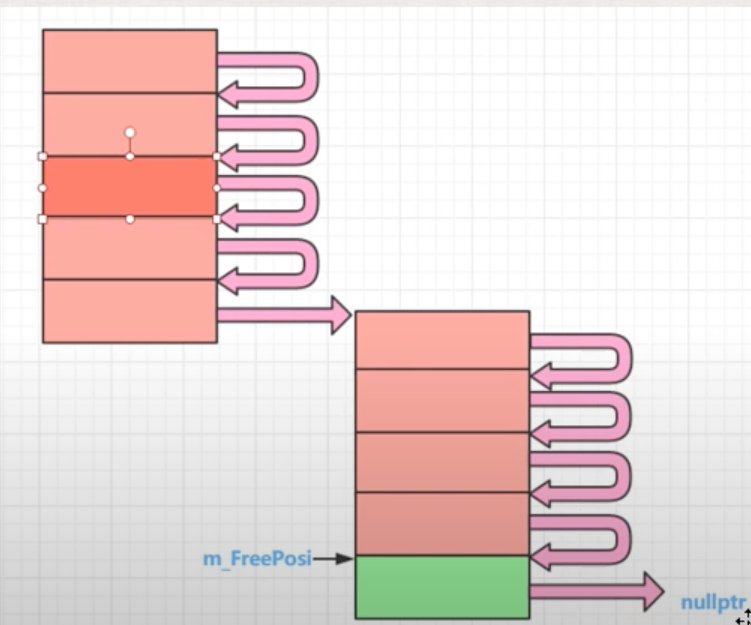
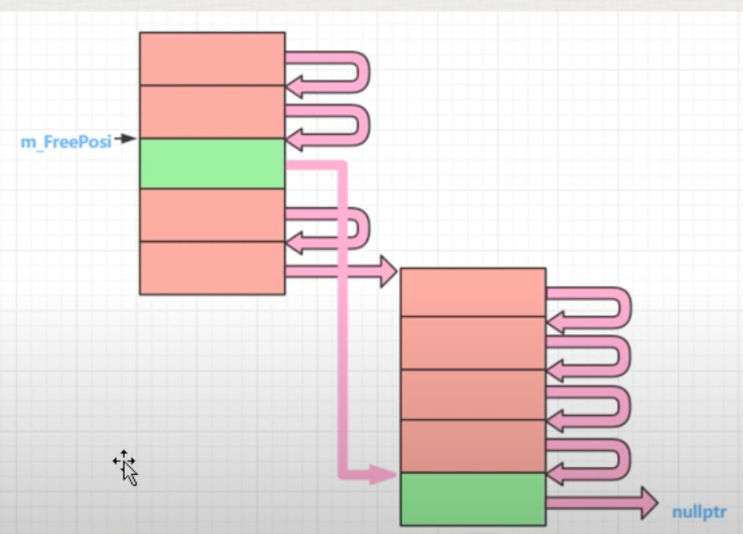

# 内存池

## 内存池概念和实现原理

**内存池实现原理：**

+ 用`malloc`申请一大块内存，当你要分配的时候，从这一大块内存中一点一点的分配给使用者；
+ 当申请的一大块内存不够时，再用`malloc`申请一大块内存，然后继续一点一点的分配给使用者；

**使用内存池的目的：**

+ 减少内存浪费；
+ 提高运行效率； 

## 针对一个类的内存池实现代码

```c++
/* ************************************************************************
> File Name:     test.cpp
> Author:        niu0217
> Created Time:  Thu 08 Feb 2024 04:50:35 PM CST
> Description:
 ************************************************************************/

#include<iostream>
#include<ctime>
using namespace std;

// #define MY_MEM_POOL 1

class A {
public:
    static void* operator new(size_t size);
    static void operator delete(void* phead);
    static int m_newCount;
    static int m_mallocCount;
private:
    A* next;
    static A* m_freePosi; //总是指向一块可以分配出去的内存的首地址
    static int m_sTrunkCount; //一次分配多少倍的该类内存
};

int A::m_newCount = 0;
int A::m_mallocCount = 0;
A* A::m_freePosi = nullptr;
int A::m_sTrunkCount = 5; //一次分配5倍的该类内存作为内存池的大小

void* A::operator new(size_t size) {
#ifdef MY_MEM_POOL
    A* ppoint = (A*)malloc(size);
    return ppoint;
#endif
    A* tempLink;
    if(m_freePosi == nullptr) {
        //申请一大块内存
        size_t realSize = m_sTrunkCount * size;
        m_freePosi = reinterpret_cast<A*>(new char[realSize]);
        tempLink = m_freePosi;
        //把分配出来的这一大块内存(5小块),彼此链接起来，方便后续使用
        for(; tempLink != &m_freePosi[m_sTrunkCount - 1]; ++tempLink) {
            tempLink->next = tempLink + 1;
        }
        tempLink->next = nullptr;
        ++m_mallocCount;
    }
    tempLink = m_freePosi;
    m_freePosi = m_freePosi->next;
    ++m_newCount;

    return tempLink;
}

void A::operator delete(void* phead) {
#ifdef MY_MEM_POOL
    free(phead);
    return;
#endif
    (static_cast<A*>(phead))->next = m_freePosi;
    m_freePosi = static_cast<A*>(phead);
}

void func() {
    clock_t start;
    clock_t end;
    start = clock();
    for(int i = 0; i < 500'0000; i++) {
        A* pa = new A();
    }
    end = clock();
    double milliseconds = ((double)(end - start) * 1000.0) / CLOCKS_PER_SEC;
    double seconds = (double)(end -start) / CLOCKS_PER_SEC;
    cout<<"申请分配内存的次数为："<<A::m_newCount<<endl;
    cout<<"实际malloc的次数为：  "<<A::m_mallocCount<<endl;
    cout<<"用时（毫秒）："<<milliseconds<<endl;
}

int main()
{
    func();
}
```

输出结果：

```bash
ubuntu@niu0217:~/Dev/C++ObjectModern/constructor$ ./test
申请分配内存的次数为：5000000
实际malloc的次数为：  1000000
用时（毫秒）：71.346
```

+ `operator delete`代码解释：

 

 

## 后续说明

```c++
/* ************************************************************************
> File Name:     test.cpp
> Author:        niu0217
> Created Time:  Thu 08 Feb 2024 04:50:35 PM CST
> Description:
 ************************************************************************/

#include<iostream>
#include<ctime>
using namespace std;

// #define MY_MEM_POOL 1

class A {
public:
    static void* operator new(size_t size);
    static void operator delete(void* phead);
    static int m_newCount;
    static int m_mallocCount;
private:
    A* next;
    static A* m_freePosi; //总是指向一块可以分配出去的内存的首地址
    static int m_sTrunkCount; //一次分配多少倍的该类内存
};

int A::m_newCount = 0;
int A::m_mallocCount = 0;
A* A::m_freePosi = nullptr;
int A::m_sTrunkCount = 5; //一次分配5倍的该类内存作为内存池的大小

void* A::operator new(size_t size) {
#ifdef MY_MEM_POOL
    A* ppoint = (A*)malloc(size);
    return ppoint;
#endif
    A* tempLink;
    if(m_freePosi == nullptr) {
        //申请一大块内存
        size_t realSize = m_sTrunkCount * size;
        m_freePosi = reinterpret_cast<A*>(new char[realSize]);
        tempLink = m_freePosi;
        //把分配出来的这一大块内存(5小块),彼此链接起来，方便后续使用
        for(; tempLink != &m_freePosi[m_sTrunkCount - 1]; ++tempLink) {
            tempLink->next = tempLink + 1;
        }
        tempLink->next = nullptr;
        ++m_mallocCount;
    }
    tempLink = m_freePosi;
    m_freePosi = m_freePosi->next;
    ++m_newCount;

    return tempLink;
}

void A::operator delete(void* phead) {
#ifdef MY_MEM_POOL
    free(phead);
    return;
#endif
    (static_cast<A*>(phead))->next = m_freePosi;
    m_freePosi = static_cast<A*>(phead);
}

void func() {
    clock_t start;
    clock_t end;
    start = clock();
    for(int i = 0; i < 15; i++) {
        A* pa = new A();
        printf("%p\n", pa);
    }
    end = clock();
    double milliseconds = ((double)(end - start) * 1000.0) / CLOCKS_PER_SEC;
    double seconds = (double)(end -start) / CLOCKS_PER_SEC;
    cout<<"申请分配内存的次数为："<<A::m_newCount<<endl;
    cout<<"实际malloc的次数为：  "<<A::m_mallocCount<<endl;
    cout<<"用时（毫秒）："<<milliseconds<<endl;
}

int main()
{
    func();
}
```

输出：

```bash
ubuntu@niu0217:~/Dev/C++ObjectModern/constructor$ ./test

0x557822c74eb0
0x557822c74eb8
0x557822c74ec0
0x557822c74ec8
0x557822c74ed0

0x557822c752f0
0x557822c752f8
0x557822c75300
0x557822c75308
0x557822c75310

0x557822c75320
0x557822c75328
0x557822c75330
0x557822c75338
0x557822c75340

申请分配内存的次数为：15
实际malloc的次数为：  3
用时（毫秒）：0.06
```

我们发现每5个地址都是有规律的。