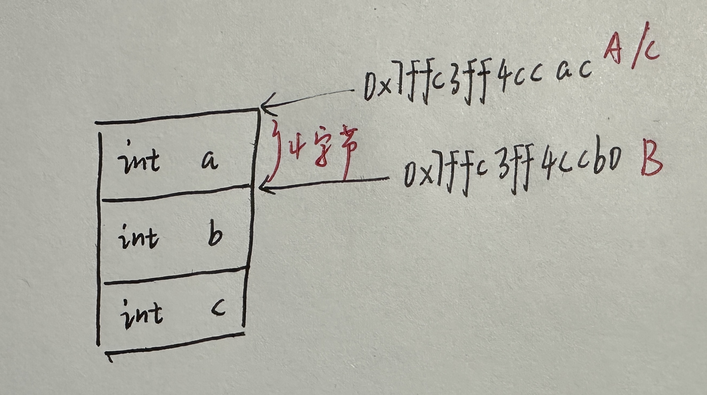

# 对象this指针调整

```c++
#include<iostream>
using namespace std;

class A {
public:
    int a;
    A() {
        printf("A::A()的this指针是：%p\n", this);
    }
    void funcA() {
        printf("A::funcA()的this指针是：%p\n", this);
    }
};

class B {
public:
    int b;
    B() {
        printf("B::B()的this指针是：%p\n", this);
    }
    void funcB() {
        printf("B::funcB()的this指针是：%p\n", this);
    }
};

class C : public A, public B {
public:
    int c;
    C() {
        printf("C::C()的this指针是：%p\n", this);
    }
    void funcC() {
        printf("C::funcC()的this指针是：%p\n", this);
    }
};

int main()
{
    cout<<sizeof(A)<<endl;
    cout<<sizeof(B)<<endl;
    cout<<sizeof(C)<<endl<<endl;

    C objectC;
    objectC.funcA();
    objectC.funcB();
    objectC.funcC();
}
```

输出：

```bash
4
4
12

A::A()的this指针是：0x7ffc3ff4ccac
B::B()的this指针是：0x7ffc3ff4ccb0
C::C()的this指针是：0x7ffc3ff4ccac
A::funcA()的this指针是：0x7ffc3ff4ccac
B::funcB()的this指针是：0x7ffc3ff4ccb0
C::funcC()的this指针是：0x7ffc3ff4ccac
```

**解释：**

创建对象objectC的时候，会依次调用A、B、C的构造函数，因此输出：

```bash
A::A()的this指针是：0x7ffc3ff4ccac
B::B()的this指针是：0x7ffc3ff4ccb0
C::C()的this指针是：0x7ffc3ff4ccac
```

然后，调用`objectC.funcA();`。因为`funcA`属于类A，所以使用的是类A的`this`地址。同理，调用`objectC.funcB();`。`funcB`属于类B，所以使用类B的`this`地址。然后是调用类C的`funcC`。这一切都是编译器在背后默默的调整`this`指针。

**关系图：**

 

