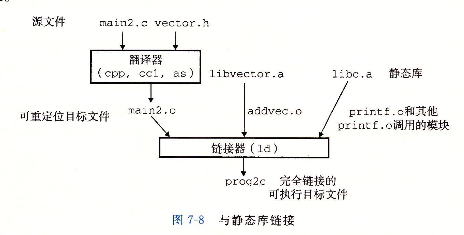

# 符号解析

## 1. 简介

链接器解析符号引用的方法是将每个引用与它输入的可重定位目标文件中的符号表中的一个确定的符号关联起来。对那些和引用定义在相同模块中的局部符号的引用，符号解析是非常简单明了的。编译器只允许每个模块中每个局部符号有一个定义。静态局部变量也会有本地链接器符号，编译器还要确保它们拥有唯一的名字。

不过，对于全局符号的引用解析就棘手很多。当编译器遇到一个不是在当前模块中定义的符号（变量或函数名）时，会假设该符号是在其他模块中定义的，生成一个链接器符号表条目，并把它交给链接器处理。如果链接器在它的任何输入模块中都找不到这个被引用符号的定义，就输出一条（通常很难阅读的）错误信息并终止。

## 2. 链接器如何解析多重定义的全局符号

链接器的输入是一组可重定位目标模块。每个模块定义一组符号，有些是局部的（只对定义该符号的模块可见），有些是全局的（对其他模块也可见）。如果多个模块定义同名的全局符号，链接器有自己的处理方式，如下：

在编译时，编译器向汇编器输出每个全局符号，或者是强，或者是弱，而汇编器把这个信息隐含地编码在可重定位目标文件的符号表中。

+ 函数和已初始化的全局变量是强符号；

+ 未初始化的全局变量是弱符号；

根据强弱符号的定义，Linux链接器使用下面的规则来处理多重定义的符号名：

+ 规则1：不允许有多个同名的强符号；
+ 规则2：如果有一个强符号和多个弱符号同名，则选择强符号；
+ 规则3：如果有多个弱符号同名，则从这些弱符号中随机选择一个；

**举例：**

（1）例子1

```c++
//foo1.c

int main()
{
  return 0;
}
```

```c++
//bar1.c
int main()
{
  return 0;
}
```

编译器在编译两个文件的时候会报错，因为函数main是强符号，并且在foo1.c和bar1.c都有定义，所以违反了规则1。

（2）例子2

```c++
//foo2.c
int x = 15213;

int main()
{
  return 0;
}
```

```c++
//bar2.c
int x = 15213;

void f()
{
  
}
```

编译器在编译两个文件的时候会报错。因为x在foo2.c和bar2.c都进行了定义，并且x是全局变量，所以x在foo2.c和bar2.c中都是强符号，违反了规则1。

（3）例子3

```c++
//foo3.c
#include<stdio.h>
void f(void);

int x = 15213;

int main()
{
  f();
  printf("x=%d\n",x);
  return 0;
}
```

```c++
//bar3.c
int x;
void f()
{
  x = 15212;
}
```

在这个例子中，函数f在foo3.c没定义，所以链接的时候会找到bar3.c中的已经定义的函数f。符合规则2。

（4）例子4

```c++
//foo4.c

#include<stdio.h>
void f(void);

int x;

int main()
{
  x = 15213;
  f();
  printf("x=%d\n",x);
  return 0;
}
```

```c++
//bar4.c

int x;

void f()
{
  x = 15312;
}
```

在这个例子中，符号x在foo4.c和bar4.c都没有初始化，所以是两个弱符号，链接器随机选择一个。符合规则3。

（5）例子5

```c++
//foo5.c
#include<stdio.h>
void f(void);

int y = 15212;
int x = 15213;

int main()
{
  f();
  printf("x=0x%x y=0x%x \n", x, y);
  return 0;
}
```

```c++
//bar5.c
double x;

void f()
{
  x = -0.0;
}
```

编译：

```bash
gcc -Wall -o footest foo5.c bar5.c
```

执行结果：

```bash
ubuntu@niu0217:~/Dev/C++ObjectModern/objfile$ ./footest
x=0x0 y=0x3b6c
```

解释：

+ x在bar5.c中是全局符号，未初始化，所以是弱符号；
+ x在foo5.c中是全局符号，已初始化，所以是强符号；
+ 根据规则2，bar5.c中的函数f中`x = -0.0;`，这个x是foo5.c中int x，而不是bar5.c中的double x。
+ 这个时候赋值的话，就会覆盖foo5.c中y的值。很烦。

解决办法：

```bash
gcc -fno-common -o footest foo5.c bar5.c
```

告诉编译器，在遇到多重定义的全局符号时，触发一个错误。

## 3. 与静态库链接

所有的编译器都提供一种机制，将所有相关的目标文件模块打包成为一个独立的文件，成为静态库，它可以用做链接器的输入。当链接器构造一个输出的可执行文件时，它只复制静态库中被应用程序引用的目标模块。

在Linux系统中，静态库以一种称为存档（archive）的特殊文件格式存在在磁盘中。存档文件是一组连接起来的可重定位目标文件的集合，有一个头部用来描述每个成员目标文件的大小和位置。存档文件名由后缀`.a`标识。

举例：

```C++
//addvec.c

int addcnt = 0;

void addvec(int* x, int* y, int* z, int n) {
    int i;
    addcnt++;
    for(i = 0; i < n; i++) {
        z[i] = x[i] + y[i];
    }
}
```

```c++
//multvec.c

int multcnt = 0;

void multvec(int* x, int* y, int* z, int n) {
    int i;
    multcnt++;
    for(i = 0; i < n; i++) {
        z[i] = x[i] * y[i];
    }
}
```

```bash
gcc -c addvec.c multvec.c

ar rcs libvector.a addvec.o multvec.o
```

- `ar` 是程序名。
- rcs是一组选项： 
  - `r` 代表替换现有文件。
  - `c` 创建归档文件，如果它不存在的话。
  - `s` 创建一个归档索引，加快访问归档中文件的速度。
- `libvector.a` 是你要创建的静态库的名字。
- `addvec.o` 和 `multvec.o` 是目标文件，会被包含在`libvector.a`这个静态库中。

```c++
//main2.c

#include<stdio.h>

addvec(int* x, int* y, int* z, int n);
multvec(int* x, int* y, int* z, int n);

int x[2] = { 1, 2 };
int y[2] = { 3, 4 };
int z[2];

int main()
{
    addvec(x, y, z, 2);
    printf("z = [%d %d]\n", z[0], z[1]);
    return 0;
}
```

```bash
gcc -c main2.c

gcc -static -o prog2c main2.o -L. -lvector
```

`-static`参数告诉编译器驱动程序，链接器应该构建一个完全链接的可执行目标文件，它可以加载到内存并运行，在加载时无须更进一步的链接。`-lvector`是`libvector.a`的缩写，`-L.`告诉链接器在当前目录下查找`libvector.a`。

 

当链接器运行时，它判定`main.o`引用了`addvec.o`中定义的`addvec`符号，所以复制`addvec.o`到可执行文件。因为程序不引用任何由`multvec.o`定义的符号，所以链接器不会复制这个模块到可执行文件中。链接器还会复制`libc.a`中的`printf.o`模块，以及许多C运行时系统中的其他模块。

## 4. 链接器如何使用静态库来解析引用

在符号解析阶段，链接器从左到右按照它们在编译器驱动程序命令行上出现的顺序来扫描可重定位目标文件和存档文件。（驱动程序自动将命令行中所有的`.c`文件翻译为`.o`文件。）在这次扫描中，链接器维护一个可重定位目标文件的**集合E**（这个集合中的文件会被合并起来形成可执行文件），一个未解析的符号（即引用了但是尚未定义的符号）**集合U**，以及一个在前面输入文件中已定义的符号**集合D**。初始时，E、U和D均为空。

+ 对于命令行上的每个输入文件`f`，链接器会判断`f`是一个目标文件还是一个存档文件。如果`f`是一个目标文件，那么链接器把`f`添加到E，修改U和D来反映`f`中的符号定义和引用，并继续下一个输入文件；

+ 如果`f`是一个存档文件，那么链接器就尝试匹配U中未解析的符号和由存档文件成员定义的符号。如果某个存档文件成员`m`，定义了一个符号来解析U中的一个引用，那么就将`m`添加到E中，并且链接器修改U和D来反映`m`中的符号定义和引用。对存档文件中所有的成员目标文件都依次进行这个过程，直到U和D都不在发生变化。此时，任何不包含在E中的成员目标文件都简单地被丢弃，而链接器将继续处理下一个输入文件；

+ 如果当链接器完成对命令行上输入文件的扫描后，U是非空的，那么链接器就会输出一个错误并终止。否则，它会合并和重定位E中的目标文件，构建输出的可执行文件。

困扰人的错误：

```bash
gcc -static ./libvector.a main2.c
```

这会报错，原因是在处理`libvector.a`的时候，U是空的，所以没有`libvector.a`中的成员目标文件会添加到E中。因此，对`addvec`的引用是绝对不会被解析的。

关于库的一般准则是将它们放在命令行的结尾。

+ 如果各个库的成员是相互独立的（也就是说没有成员引用另一个成员定义的符号），那么这些库就可以以任何顺序放置在命令行的结尾处。

+ 如果库不是独立的，那么必须对它们排序，使得对于每个被存档文件的成员外部引用的符号`s`，在命令行中至少有一个`s`的定义是在对`s`的引用之后的。比如，假设`foo.c`调用了`libx.a`和`libz.a`中的函数，而这两个库又调用`liby.a`中的函数。那么，在命令行中`libx.a`和`libz.a`必须处在`liby.a`之前。

  ```bash
  gcc foo.c libx.a libz.a liby.a
  ```

+ 如果需要满足依赖需求，可以在命令行上重复库。比如，假设`foo.c`调用了`libx.a`中的函数，该库又调用`liby.a`中函数，而`liby.a`又调用`libx.a`中的函数。那么`libx.a`必须在命令行上重复出现。

  ```bash
  gcc foo.c libx.a liby.a libx.a
  ```

  
