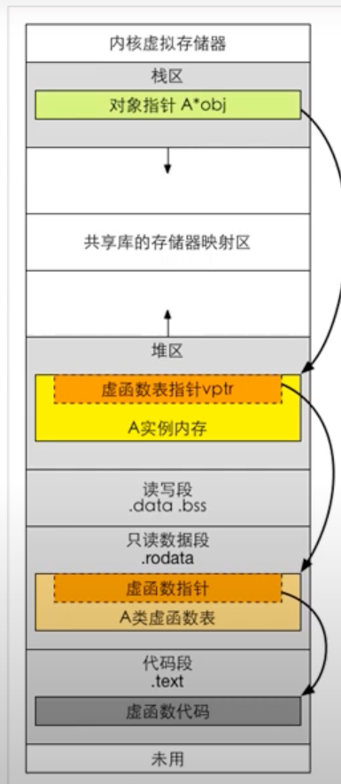

# 虚函数

## 1. 引入

**代码：**

```c++
//test.cpp

#include<iostream>
using namespace std;

class A {
public:
    int m_value;
    A() : m_value{0} { }
    virtual void testVirtualOne() {

    }
};

int main()
{
    A objA;
    int lengthOfObjA = sizeof(objA);
    cout<<lengthOfObjA<<endl;
}
```

**分析：**

```bash
In file: /home/ubuntu/Dev/C++ObjectModern/virtual_function/test.cpp
   11 };
   12
   13 int main()
   14 {
   15     A objA;
 ► 16     int lengthOfObjA = sizeof(objA);
   17     cout<<lengthOfObjA<<endl;
   18 }
   
#objA的虚表   
pwndbg> info vtbl objA
vtable for 'A' @ 0x555555557d70 (subobject @ 0x7fffffffe8d0):
[0]: 0x5555555552c6 <A::testVirtualOne()>

#对象objA的内存布局
pwndbg> x/4gx 0x7fffffffe8d0
0x7fffffffe8d0:	0x0000555555557d70	0x0000555500000000
0x7fffffffe8e0:	0x00007fffffffe9e0	0x00a8b7ddf6a2da00

#objA的m_value
pwndbg> x/wx 0x7fffffffe8d0+0x8
0x7fffffffe8d8:	0x00000000
```

## 2. 继承关系下虚函数的手工调用

**代码：**

```c++
#include<iostream>
using namespace std;

class Base {
public:
    virtual void vtestOne() {
        cout<<"Base::vtestOne()"<<endl;
    }
    virtual void vtestTwo() {
        cout<<"Base::vtestTwo()"<<endl;
    }
    virtual void vtestThree() {
        cout<<"Base::vtestThree()"<<endl;
    }
};

class Derived : public Base {
public:
    void vtestTwo() override {
        cout<<"Derived::vtestTwo()"<<endl;
    }
};

void callVirtualFunction(Base* d) {
    long* pvptr = (long*)d;
    long* vptr = (long*)(*pvptr);

    for(int i = 0; i < 3; i++) {
        printf("vptr[%d] = 0x:%p\n", i, vptr[i]);
    }

    typedef void(*Func)(void);
    Func one = (Func)vptr[0];
    Func two = (Func)vptr[1];
    Func three = (Func)vptr[2];
    one();
    two();
    three();
    cout<<"\n\n";
}

int main()
{
    Base* d = new Base();
    callVirtualFunction(d);

    d = new Derived();
    callVirtualFunction(d);
}
```

**输出：**

```bash
vptr[0] = 0x:0x55fa56e8f374
vptr[1] = 0x:0x55fa56e8f3b0
vptr[2] = 0x:0x55fa56e8f3ec
Base::vtestOne()
Base::vtestTwo()
Base::vtestThree()


vptr[0] = 0x:0x55fa56e8f374
vptr[1] = 0x:0x55fa56e8f428
vptr[2] = 0x:0x55fa56e8f3ec
Base::vtestOne()
Derived::vtestTwo()
Base::vtestThree()
```

## 3. 多重继承虚函数表分析

**代码：**

```c++
#include<iostream>
using namespace std;

class Base1 {
public:
    virtual void f() {
        cout<<"Base1::f()\n";
    }
    virtual void g() {
        cout<<"Base1::g()\n";
    }
};

class Base2 {
public:
    virtual void h() {
        cout<<"Base2::h()\n";
    }
    virtual void k() {
        cout<<"Base2::k()\n";
    }
};

class Derived : public Base1, public Base2 {
public:
    void f() override {
        cout<<"Derived::f()\n";
    }
    void k() override {
        cout<<"Derived::k()\n";
    }
    virtual void vfunc1() {
        cout<<"Derived::vfunc1()\n";
    }
    virtual void vfunc2() {
        cout<<"Derived::vfunc2()\n";
    }
    virtual void vfunc3() {
        cout<<"Derived::vfunc3()\n";
    }
};

int main()
{
    cout<<sizeof(Base1)<<endl;
    cout<<sizeof(Base2)<<endl;
    cout<<sizeof(Derived)<<endl;

    Derived ins;
    Base1& b1 = ins;
    Base2& b2 = ins;
    Derived& d = ins;

    typedef void(*Func)(void);
    //取第一个虚函数表指针
    long* pderived1 = (long*)(&ins);
    long* vptr1 = (long*)(*pderived1);
    //取第二个虚函数表指针
    long* pderived2 = pderived1 + 1;
    long* vptr2 = (long*)(*pderived2);

    Func f0 = (Func)vptr1[0];
    Func f1 = (Func)vptr1[1];
    Func f2 = (Func)vptr1[2];
    Func f3 = (Func)vptr1[3];
    Func f4 = (Func)vptr1[4];
    Func f5 = (Func)vptr1[5];

    Func f00 = (Func)vptr2[0];
    Func f11 = (Func)vptr2[1];

    f0();
    f1();
    f2();
    f3();
    f4();
    f5();

    f00();
    f11();
}
```

**分析：**

```bash
pwndbg> info vtbl b1
vtable for 'Base1' @ 0x555555557cd8 (subobject @ 0x7fffffffe8d0):
[0]: 0x55555555544c <Derived::f()>
[1]: 0x555555555400 <Base1::g()>


pwndbg> info vtbl b2
vtable for 'Base2' @ 0x555555557d18 (subobject @ 0x7fffffffe8d8):
[0]: 0x555555555426 <Base2::h()>
[1]: 0x555555555498 <non-virtual thunk to Derived::k()>


pwndbg> info vtbl d
vtable for 'Derived' @ 0x555555557cd8 (subobject @ 0x7fffffffe8d0):
[0]: 0x55555555544c <Derived::f()>
[1]: 0x555555555400 <Base1::g()>
[2]: 0x555555555472 <Derived::k()>
[3]: 0x5555555554a2 <Derived::vfunc1()>
[4]: 0x5555555554c8 <Derived::vfunc2()>
[5]: 0x5555555554ee <Derived::vfunc3()>

vtable for 'Base2' @ 0x555555557d18 (subobject @ 0x7fffffffe8d8):
[0]: 0x555555555426 <Base2::h()>
[1]: 0x555555555498 <non-virtual thunk to Derived::k()>


pwndbg> x/2gx 0x7fffffffe8d0
0x7fffffffe8d0:	0x0000555555557cd8	0x0000555555557d18
```

+ ins的地址为0x7fffffffe8d0

+ 0x7fffffffe8d0内存布局：

  ```bash
  pwndbg> x/2gx 0x7fffffffe8d0
  0x7fffffffe8d0:	0x0000555555557cd8	0x0000555555557d18
  ```

  其中0x0000555555557cd8是虚表指针1；0x0000555555557d18是虚表指针2；

## 4. vptr和vtbl创建时机

+ 虚函数表指针vptr属于对象，对象什么时候创建，它就什么时候创建。因此虚函数表指针vptr在类的构造函数中创建。
+ 虚函数表vtbl是编译器在编译期间（不是运行期间）就为每个类确定好了对应的虚函数表vtbl的内容。然后也是在编译期间在相应的类构造函数中添加给vptr赋值的代码，这样程序运行的时候，当运行到生成类对象的代码时，会调用类的构造函数中的给vptr赋值的代码。这样这个对象的vptr就有值了。

## 5. 虚函数在虚拟内存中的位置

 

## 6. 单纯的类不纯时引发的虚函数调用问题

### 6.1 引入

**定义：**

+ 单纯的类：比较简单的类，不包含虚函数和虚基类。
+ 不单纯的类：含有虚基类或者虚函数的类，以及在某些情况下，编译器会往类内部增加一些我们看不见，但真实存在的成员变量（隐藏成员变量），有了这种变量的类，就不单纯了。同时，这种隐藏成员变量的增加（使用）或者赋值的时机，往往都是在执行构造函数和拷贝构造函数的函数体之前进行。那么如果使用memset或者memcpy，很可能把编译器给隐藏变量的值给修改了。虚函数表指针就是一个隐藏的成员变量。

**例子：**

```c++
#include<iostream>
#include<cstring>
using namespace std;

class X {
public:
    int x;
    int y;
    int z;
    X() {
        memset(this, 0, sizeof(X)); //有虚函数时可能会出问题
        cout<<"构造函数被调用\n";
    }
    X(const X& other) {
        memcpy(this, &other, sizeof(X)); //有虚函数时可能会出问题
        cout<<"拷贝构造函数被调用\n";
    }
};

int main()
{
    X x0;
    x0.x = 100;
    x0.y = 200;
    x0.z = 300;

    X x1(x0);
    cout<<"x1.x = "<<x1.x<<" x1.y = "<<x1.y<<" x1.z = "<<x1.z<<endl;
}
```

这个类中不会出问题，但是memset和memcpy在以后不保证不出问题。

**会出问题的代码：**

```c++
#include<iostream>
#include<cstring>
using namespace std;

class X {
public:
    int x;
    int y;
    int z;
    X() {
        memset(this, 0, sizeof(X)); //有虚函数时可能会出问题
        cout<<"构造函数被调用\n";
    }
    X(const X& other) {
        memcpy(this, &other, sizeof(X)); //有虚函数时可能会出问题
        cout<<"拷贝构造函数被调用\n";
    }
   virtual  ~X() {
       cout<<"析构函数被调用\n";
   }
   virtual void vfunc() {
       cout<<"虚函数vfunc被调用\n";
   }
   void func() {
       cout<<"普通函数func被调用\n";
   }
};

int main()
{
    X x0;
    x0.x = 100;
    x0.y = 200;
    x0.z = 300;

    X x1(x0);
    cout<<"x1.x = "<<x1.x<<" x1.y = "<<x1.y<<" x1.z = "<<x1.z<<endl;
    x1.func();
    x1.vfunc(); //这个虚函数表指针为nullptr,但是为啥还能调用虚函数?

    cout<<endl<<endl;
    X* px0 = new X();
    px0->func(); //可以正常调用
    px0->vfunc(); //无法正常调用
    delete px0; //无法正常调用
    px0 = nullptr;
}
```

重要概念：虚函数主要解决的问题是父类指针或引用指向子类对象这种情况。这其中有继承关系。

而上面的代码` x1.vfunc();`没有继承关系，这和普通的函数调用没有区别，所以不会出错。

### 6.2 逐步分析

#### 6.2.1 情况一

**代码：**

```c++
#include<iostream>
#include<cstring>
using namespace std;

class X {
public:
    int x;
    int y;
    int z;
    X() {
        memset(this, 0, sizeof(X)); //有虚函数时可能会出问题
        cout<<"构造函数被调用\n";
    }
    X(const X& other) {
        memcpy(this, &other, sizeof(X)); //有虚函数时可能会出问题
        cout<<"拷贝构造函数被调用\n";
    }
   virtual  ~X() {
       cout<<"析构函数被调用\n";
   }
   virtual void vfunc() {
       cout<<"虚函数vfunc被调用\n";
   }
   void func() {
       cout<<"普通函数func被调用\n";
   }
};

int main()
{
    int i = 9;
    printf("i的地址 = %p\n", &i);
    X x0;
    printf("func()的地址 = %p\n", &X::func);

    x0.func();
    x0.vfunc();
}
```

分析如下代码：

```bash
In file: /home/ubuntu/Dev/C++ObjectModern/virtual_function/test.cpp
   31     int i = 9;
   32     printf("i的地址 = %p\n", &i);
   33     X x0;
   34     printf("func()的地址 = %p\n", &X::func);
   35
 ► 36     x0.func();
   37     x0.vfunc();
   38 }
```

反汇编代码：

```assembly
=> 0x00005555555552a7 <+126>:	lea    rax,[rbp-0x40]
   0x00005555555552ab <+130>:	mov    rdi,rax
   0x00005555555552ae <+133>:	call   0x55555555544a <X::func()>
   0x00005555555552b3 <+138>:	lea    rax,[rbp-0x40]
   0x00005555555552b7 <+142>:	mov    rdi,rax
   0x00005555555552ba <+145>:	call   0x555555555424 <X::vfunc()>
```

我们看到`call   0x55555555544a <X::func()>`和`call   0x555555555424 <X::vfunc()>`。

得出结论：

+ `x0.func()`和`x0.vfunc()`的地址在编译的时候就已经确定了。

插入两个重要概念：

+ 静态联编：我们编译的时候就能确定调用哪个函数。把调用语句和被调用函数绑定到一起。
+ 动态联编：是在程序运行时，根据时机情况，动态的把调用语句和被调用函数绑定到一起，动态联编一般只在有多态和虚函数的情况下才存在。

#### 6.2.2 情况二

**代码：**

```c++
#include<iostream>
#include<cstring>
using namespace std;

class X {
public:
    int x;
    int y;
    int z;
    X() {
        memset(this, 0, sizeof(X)); //有虚函数时可能会出问题
        cout<<"构造函数被调用\n";
    }
    X(const X& other) {
        memcpy(this, &other, sizeof(X)); //有虚函数时可能会出问题
        cout<<"拷贝构造函数被调用\n";
    }
   virtual  ~X() {
       cout<<"析构函数被调用\n";
   }
   virtual void vfunc() {
       cout<<"虚函数vfunc被调用\n";
   }
   void func() {
       cout<<"普通函数func被调用\n";
   }
};

int main()
{
    X* px0 = new X();
    px0->func();
    px0->vfunc();
}
```

分析代码：

```c++
In file: /home/ubuntu/Dev/C++ObjectModern/virtual_function/test.cpp
   27 };
   28
   29 int main()
   30 {
   31     X* px0 = new X();
 ► 32     px0->func();
   33     px0->vfunc();
   34 }
```

反汇编代码：

```assembly
# px0->func();
=> 0x0000555555555231 <+40>:	mov    rax,QWORD PTR [rbp-0x18]
   0x0000555555555235 <+44>:	mov    rdi,rax
   0x0000555555555238 <+47>:	call   0x5555555553be <X::func()>

# px0->vfunc();
   0x000055555555523d <+52>:	mov    rax,QWORD PTR [rbp-0x18]
   0x0000555555555241 <+56>:	mov    rax,QWORD PTR [rax]
   0x0000555555555244 <+59>:	add    rax,0x10
   0x0000555555555248 <+63>:	mov    rdx,QWORD PTR [rax]
   0x000055555555524b <+66>:	mov    rax,QWORD PTR [rbp-0x18]
   0x000055555555524f <+70>:	mov    rdi,rax
   0x0000555555555252 <+73>:	call   rdx
```

从上边汇编代码我们看出`px0->vfunc()`是动态联编的。而`px0->func()`是静态联编的。

