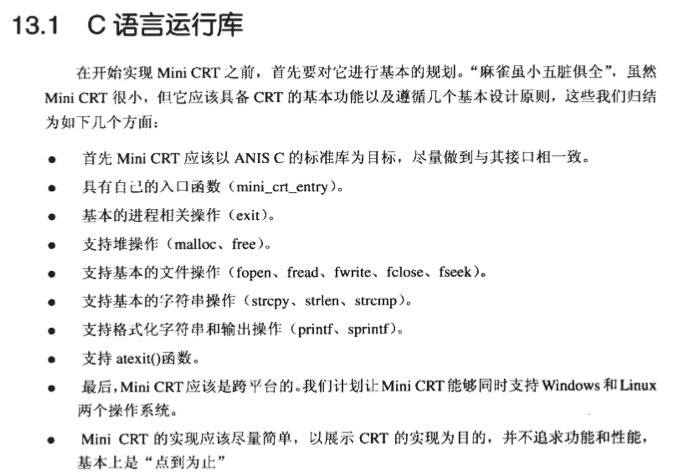
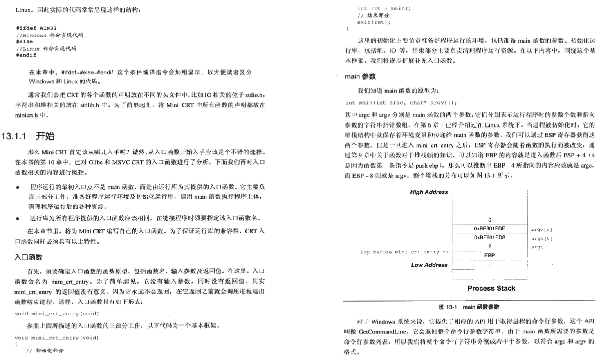
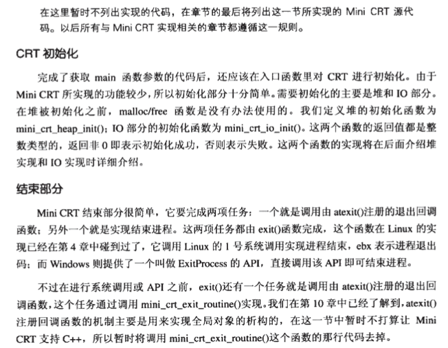
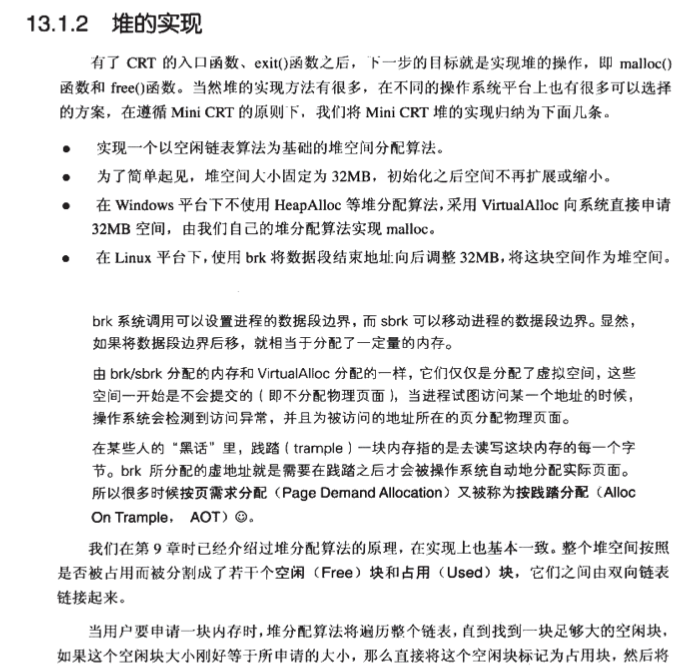
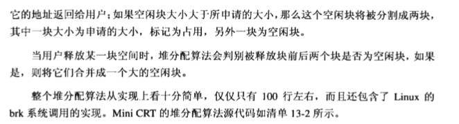
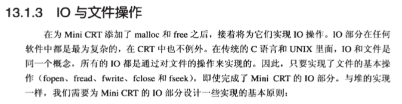
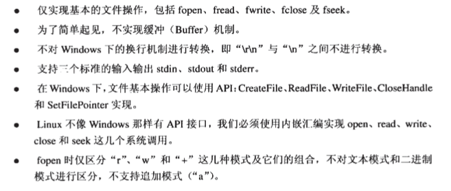

# 自己实现C语言运行库

## 引入

 

## 1. 入口函数

 

 

+ C_CRT/entry.c

## 2. 堆的实现

 

 

+ C_CRT/malloc.c

## 3. IO与文件操作

 

 

+ C_CRT/stdio.c

## 4. 字符串操作

+ C_CRT/string.c

## 5. 格式化字符串

+ C_CRT/printf.c

## 6. 库

+ C_CRT/minicrt.h

## 7. 测试代码

+ C_CRT/test.c

