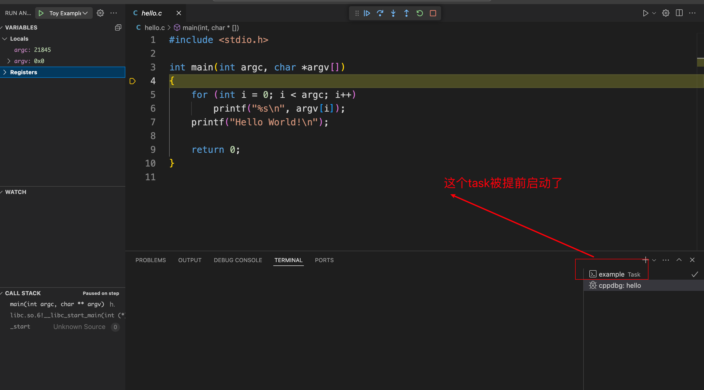
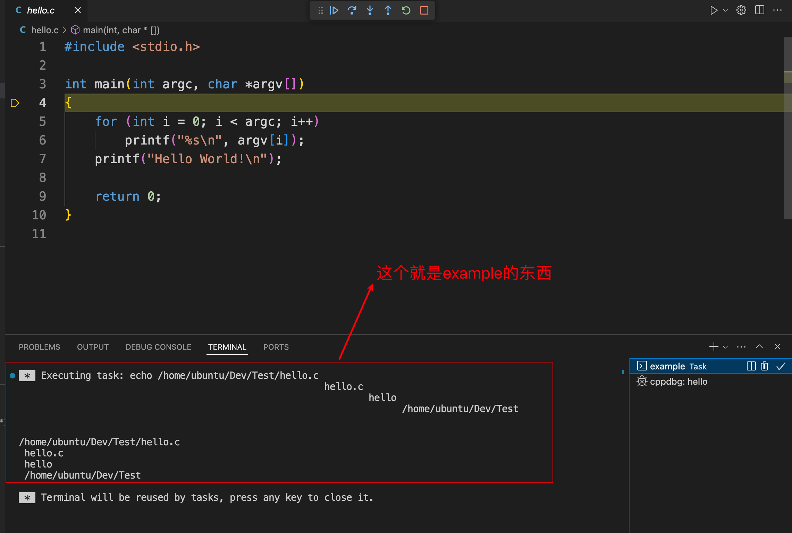

# CPlusPlus实战

## 参考资料

+ https://blog.csdn.net/qq_45488242/article/details/128414756

## 思维导图

 

## 1. 一个Toy Example: echo 宏

文件结构：

 

### 1.1 .vscode/tasks.json

```json
{
    "version": "2.0.0",
    "tasks": [
        {
            "label": "example",
            "command": "echo",
            "args": [
                "${file}\n",
                "${fileBasename}\n",
                "${fileBasenameNoExtension}\n",
                "${fileDirname}\n"
            ]
        }
    ]
}
```

### 1.2 .vscode/launch.json

```json
{
    // Use IntelliSense to learn about possible attributes.
    // Hover to view descriptions of existing attributes.
    // For more information, visit: https://go.microsoft.com/fwlink/?linkid=830387
    "version": "0.2.0",
    "configurations": [
        {
            "name": "Toy Example",
            "type": "cppdbg",
            "request": "launch",
            "program": "${workspaceFolder}/hello",
            "stopAtEntry": true,
            "cwd": "${fileDirname}",
            "preLaunchTask": "example",
            "externalConsole": false,
            "MIMode": "gdb",
        }

    ]
}
```

### 1.3 hello.c

```c
#include <stdio.h>

int main(int argc, char *argv[])
{
    for (int i = 0; i < argc; i++)
        printf("%s\n", argv[i]);
    printf("Hello World!\n");

    return 0;
}

```

### 1.4 结果

 

 

 

## 2. 顺序构建任务

### 2.1 .vscode/tasks.json

```json
{
    "version": "2.0.0",
    "tasks": [
        {
            "label": "create_bin",
            "type": "shell",
            "command": "mkdir",
            "args": [
                "-p",
                "${workspaceFolder}${pathSeparator}bin"
            ]
        },
        {
            "label": "debug_build",
            "type": "shell",
            "command": "gcc",
            "group": "build",
            "args": [
                "${file}",
                "-g",
                "-o",
                "${fileDirname}${pathSeparator}bin${pathSeparator}${fileBasenameNoExtension}"
            ],
            "dependsOn": "create_bin",
        },
    ],
}
```

### 2.2 .vscode/launch.json

```json
{
    // 使用 IntelliSense 了解相关属性。 
    // 悬停以查看现有属性的描述。
    // 欲了解更多信息，请访问: https://go.microsoft.com/fwlink/?linkid=830387
    "version": "0.2.0",
    "configurations": [
        {
            "type": "cppdbg",
            "request": "launch",
            "name": "gdb Debug",
            "program": "${workspaceFolder}${pathSeparator}bin${pathSeparator}${fileBasenameNoExtension}",
            "stopAtEntry": false,
            "preLaunchTask": "debug_build",
            "cwd": "${workspaceFolder}",
            "MIMode": "gdb",
        },
    ]
}
```

### 2.3 hello.c

```c
#include <stdio.h>

int main()
{
    printf("hello\n");
    printf("niu0217\n");
    printf("byebyes\n");
}
```

### 2.4 结果

 

## 3. 调试多进程

修改：.vscode/launch.json

```json
{
    // 使用 IntelliSense 了解相关属性。 
    // 悬停以查看现有属性的描述。
    // 欲了解更多信息，请访问: https://go.microsoft.com/fwlink/?linkid=830387
    "version": "0.2.0",
    "configurations": [
        {
            "type": "cppdbg",
            "request": "launch",
            "name": "gdb Debug",
            "program": "${workspaceFolder}${pathSeparator}bin${pathSeparator}${fileBasenameNoExtension}",
            "stopAtEntry": false,
            "preLaunchTask": "debug_build",
            "cwd": "${workspaceFolder}",
            "MIMode": "gdb",
            "setupCommands": [
                {
                    "description": "只调试子进程",
                    "text": "set follow-fork-mode child",
                    "ignoreFailures": true
                },
                {
                    "description": "表示调试当前进程的时候，其它的进程继续运行",
                    "text": "set detach-on-fork on",
                    "ignoreFailures": true
                }
            ]
        },
    ]
}
```


